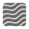
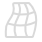

# Distortion filters

Distortion filters move pixels in your image to produce various distortion effects.

Filters are applied to your image from the **Filters** menu (destructive) or **Layer** menu (non-destructive) and mostly include customizable settings alongside general options. Non-destructive filters are called live filters, and, once applied, they can be identified as both a filter and a specific filter type by using unique symbols.

| Filter name | Description | Regular filter    (destructive) | Live filter    (non‑destructive) with layer symbol |
| --- | --- | --- | --- |
| [Affine](04-distortion-filters/01-filter-affine.md) | Moves, scales, or rotates by percentage amounts. |  |  |
| [Deform](04-distortion-filters/02-filter-deform.md) | Distorts from one or more anchor point positions. |  |  |
| [Displace](04-distortion-filters/03-filter-displace.md) | Distorts using a displacement map. |  |   |
| [Equations](04-distortion-filters/04-filter-equations.md) | Apply custom transform filter based on mathematical expressions. |  |  |
| [Lens Correction](04-distortion-filters/05-filter-lenscorrection.md) | Apply a lens profile to fix various distortions by straightening and aligning lines in an image. |  |  |
| [Lens Distortion](04-distortion-filters/06-filter-lensdistortion.md) | Fixes barrel and pincushion lens distortions. |  |   |
| [Liquify](04-distortion-filters/07-filter-liquify.md) | Apply non-destructive liquify distortions to the entire image or masked regions of it. |  |   |
| [Mesh Warp](04-distortion-filters/08-filter-meshwarp.md) | Warp an image by constructing and manipulating an overlaid, flexible mesh grid. |  |   |
| [Mirror](04-distortion-filters/09-filter-mirror.md) | Provides a reflection using one or more mirrors. |  |  |
| [Perspective](04-distortion-filters/10-filter-perspective.md) | A filter based on the Perspective Tool. |  |   |
| [Pinch/Punch](04-distortion-filters/11-filter-pinchpunch.md) | Squeezes or bulges an image area. |  |   |
| [Pixelate](04-distortion-filters/12-filter-pixelate.md) | Creates blocks of color to obscure image areas. |  |  |
| [Polar to Rectangular](04-distortion-filters/13-filter-polartorectangular.md) | Distorts by changing polar to rectilinear X/Y coordinates. |  |  |
| [Rectangular to Polar](04-distortion-filters/14-filter-rectangulartopolar.md) | Distorts by changing rectilinear X/Y to polar coordinates. |  |  |
| [Ripple](04-distortion-filters/15-filter-ripple.md) | Produces a radial rippling effect. |  |   |
| [Shear](04-distortion-filters/16-filter-shear.md) | Apply a linear or curved shear to an image horizontally and/or vertically. |  |  |
| [Spherical](04-distortion-filters/17-filter-spherical.md) | Creates a convex or concave sphere distortion. |  |   |
| [Twirl](04-distortion-filters/18-filter-twirl.md) | Creates a clockwise or anti-clockwise twirl effect. |  |   |

#### SEE ALSO:

- [Astrophotography filters](01-applying-filters/01-astrofilters.md)
- [Blur filters](02-blur-filters.md)
- [Color filters](03-color-filters.md)
- [Edge detection filters](05-edge-detection-filters.md)
- [Noise filters](06-noise-filters.md)
- [Sharpen filters](07-sharpen-filters.md)
- [Tonal filters](01-applying-filters/02-tonalfilters.md)
- [Equations](04-distortion-filters/04-filter-equations.md)
