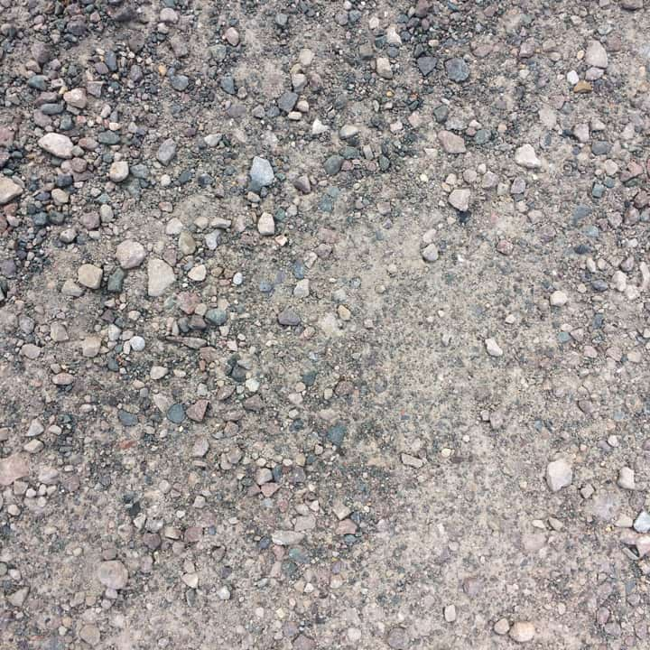
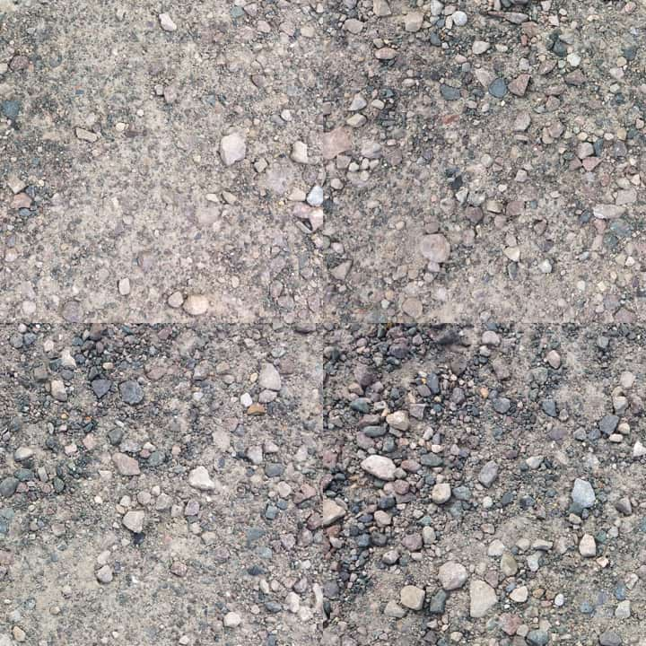
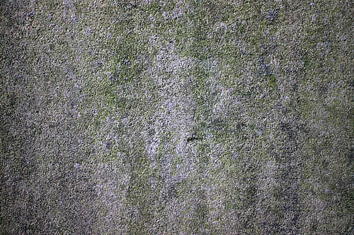
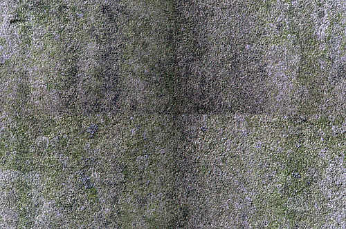

# Affine

The Affine filter allows you to move, scale and rotate either a selection or the entire document by percentage amounts.

*Using the Affine filter to flip the direction of a subject within an image (additional cloning and inpainting work required).*

## About the Affine filter

This filter can be found in the **Filters** menu, in the **Distort** category.

### Settings

The following settings can be adjusted in the filter dialog:

- **Rotation**—controls the rotation of the document or selection.
- **Scale X**/**Y**—independent controls for horizontal and vertical scaling.
- **Offset X**/**Y**—controls the horizontal and vertical offset of the document or selection.
- **Extend Mode**—specifies how to handle the blank area created by the filter:
  - **Zero**: Does not fill the blank space.
  - **Full**: Fills the blank space with pure white.
  - **Repeat**: Repeats the last edge of pixels continuously to fill the blank space.
  - **Wrap**: Wraps the selection back around; useful for seamless texture work.
  - **Mirror**: Produces a mirror image of the selection.

*Using Affine with 50% X and Y offset to expose the image edges: cloning these out will create a seamless texture.*

#### SEE ALSO:

- [Applying filters](../01-applying-filters.md)
- [Shear](16-filter-shear.md)
