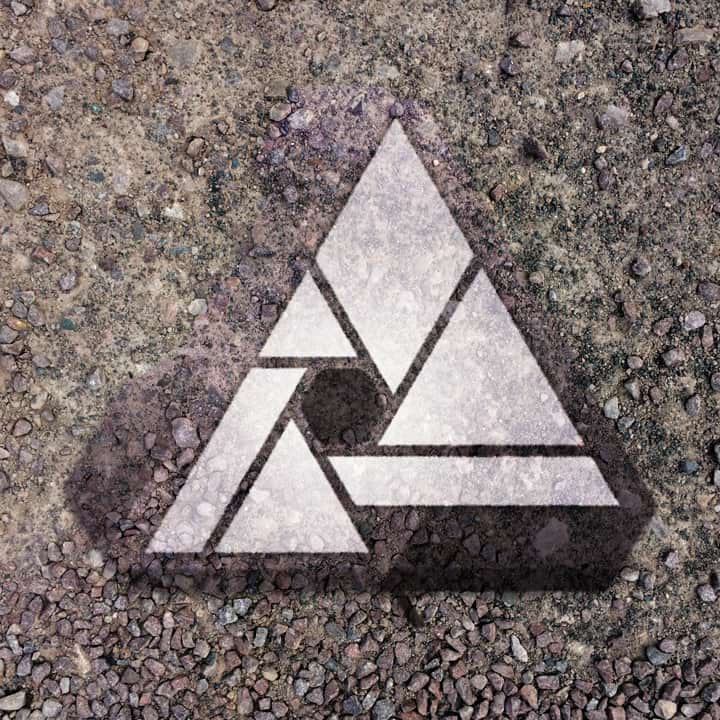

# Displace

The Displace filter applies distortion according to a pattern defined by a displacement map.

*Using a texture as a displacement map to blend objects together.*

## About the Displace filter

The displacement map used to create the distortion can be either from an external file or from layers directly beneath the layer to be edited. For the former, the Internet offers many displacement maps to download and try out. For the latter, the displacement effect works with your existing layer content, typically blending sympathetically with the underlying background texture.

This filter can be applied as a [non-destructive, live filter](../../06-layers/08-using-live-filters.md). It can be accessed via the **Layer** menu, from the **New Live Filter Layer>Distort** category.

For professional results, apply blend ranges to the live filter layer, then finely adjust the filter's Strength setting.

### Settings

The following settings can be adjusted in the filter dialog:

- **Preserve Alpha**—when enabled, it prevents empty pixels from rendering as alpha.
- **Merge**—combines the effect applied with the layers below.
- **Delete**—removes the displacement filter effect layer.
- **Reset**—returns the effect adjustments to their default values.
- **Strength**—sets the intensity of pixel displacement. Negative values shift pixels upwards, positive values shift pixels downwards. Type directly in the text box or drag the slider to set the value.
- **Scale To Fit**—when selected (default), the displacement map stretches or shrinks to fit the document size. If this option is off, the displacement map retains its native dimensions.
- **Load Method**—offers two methods for pixel displacement:
  - Sobel 3x3 intensity offset—the lightness values of pixels within the displacement map determine the degree to which the distortion occurs. This method is preferable if you would like to maintain the effect's position. Apply this method before loading the displacement map image.
  - Red/Green offset—as per Adobe Photoshop. The method uses the red and green channel of the displacement map image for distortion.
- **Load Map From File**—sets the displacement map used in the filter. In the pop-up dialog, navigate to and select a file, and click **Open**.
- **Load Map From Layers Beneath**—determines the displacement map using layers beneath the selected layer (rather that from a displacement map image described above).
- **Opacity**—controls how much of the effects is visible.
- **Blend Mode**—regulates how the pixels of the applied effect interact with the layers below.

#### SEE ALSO:

- [Using live filters](../../06-layers/08-using-live-filters.md)
- [Applying filters](../01-applying-filters.md)
- [Layer blend ranges](../../06-layers/06-layer-blend-ranges.md)
- [Shear](16-filter-shear.md)
