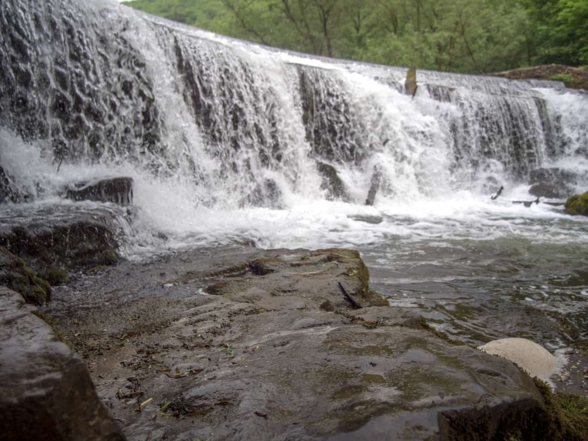
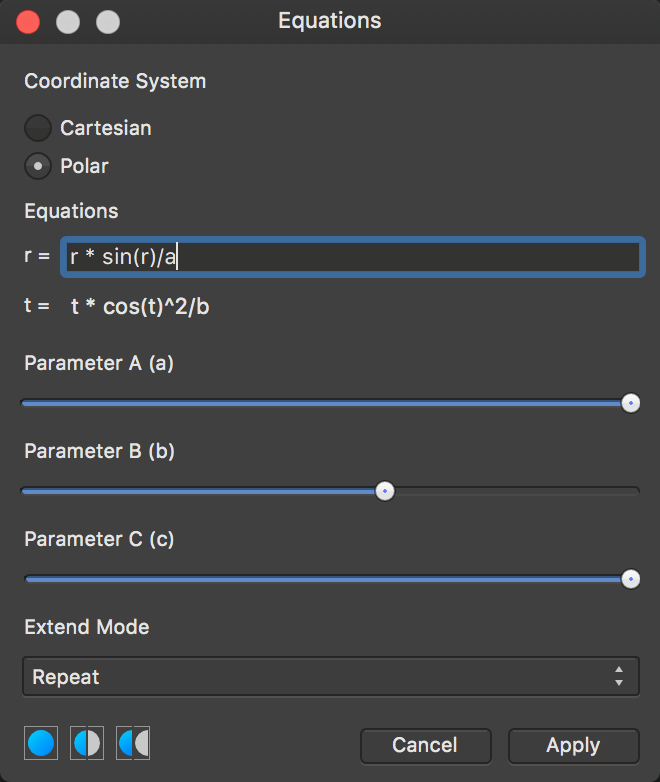

# Equations

The Equations filter allows you to apply transform filters through mathematical expressions.

*Before and after a transform equation.*

## About the Equations filter

This filter allows you to apply a transform to a pixel layer using mathematical expression. You can achieve a number of distortion-type effects through the use of predetermined variables, trigonometry, exponentiation, etc. Additionally, you can use custom variables **a**, **b** and **c** in the equations and control their values through sliders on the filter dialog.

### Settings

The following settings can be adjusted in the filter dialog:

- **Coordinate System**—choose from Cartesian or Polar coordinates.
- **Cartesian**
  - **x =**—enter expressions for the X-axis.
  - **y =**—enter expressions for the Y-axis.
- **Polar**
  - **r =**—enter expressions for the radius.
  - **t =**—enter expressions for the polar angle (theta).
- **Parameter A (a)**—controls the value of custom variable **a**.
- **Parameter B (b)**—controls the value of custom variable **b**.
- **Parameter C (c)**—controls the value of custom variable **c**.
- **Extend Mode**—chooses how to treat pixels outside of the image bounds:
  - **Zero**—fills pixels outside the image bounds with zeros (alpha values).
  - **Full**—fills pixels outside the image bounds with constant values (pure white).
  - **Repeat**—fills pixels outside the image bounds with repetitions of the image's edge pixels.
  - **Wrap**—fills pixels outside the image bounds with copies of the image; useful for positional offset filters and seamless texture authoring.
  - **Mirror**—fills pixels outside the image bounds with mirrored (reflected) copies of the image.

*An example equation being entered into the filter dialog.*

#### SEE ALSO:

- [Applying filters](../01-applying-filters.md)
- [Procedural Texture](../03-color-filters/09-filter-proceduraltexture.md)
- [Custom Blur](../02-blur-filters/06-filter-customblur.md)
- [Expressions for field input](../../38-expressions-for-field-input/01-expressions-for-field-input.md)
