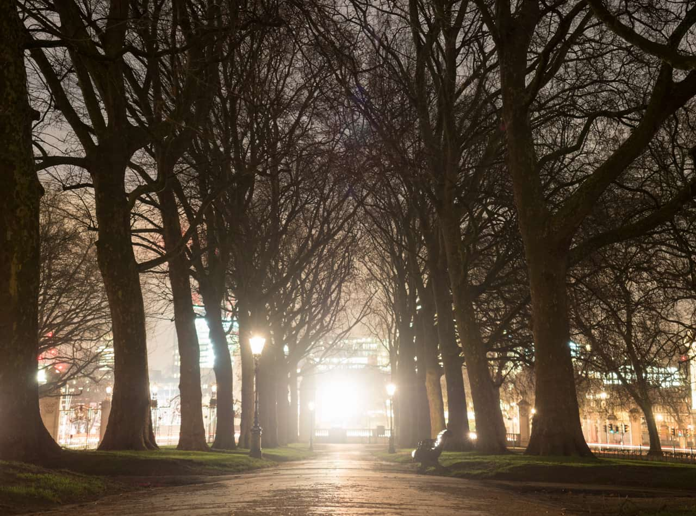
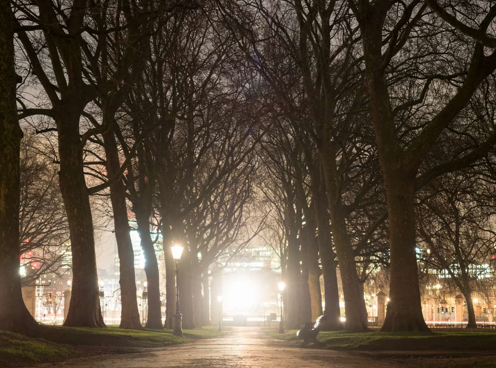

# Lens Distortion

The Lens Distortion filter provides a way of correcting distortion caused by the curvature of a camera lens. It's especially useful for correcting barrel distortion (where straight edges are bowed outwards), or for correcting pincushion distortion (where straight edges are bowed inwards).

## About the Lens Distortion filter

This filter can be applied as a [non-destructive, live filter](../../06-layers/08-using-live-filters.md). It can be accessed via the **Layer** menu, from the **New Live Filter Layer** category.

> **Note:** Drag on the image to set the origin.

### Settings

The following settings can be adjusted in the filter dialog:

- **Distortion**—controls how much the filter is applied. Type directly in the text box or drag the slider to set the value. Drag to the left (negative value) to remove barrel distortion, drag to the right (positive value) to remove pincushion distortion.

> **Tip:** Most lenses only need values between +5 and -3 to correct distortion. It's also useful to turn [grids](../../30-design-aids/15-grids.md) on so that you can see when the lines are straight.

#### SEE ALSO:

- [Using live filters](../../06-layers/08-using-live-filters.md)
- [Applying filters](../01-applying-filters.md)
- [Grids](../../30-design-aids/15-grids.md)
- [Deform](02-filter-deform.md)
