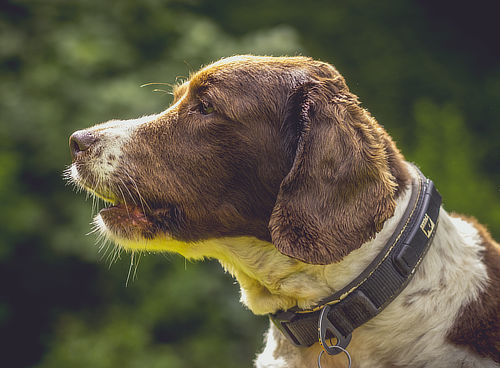
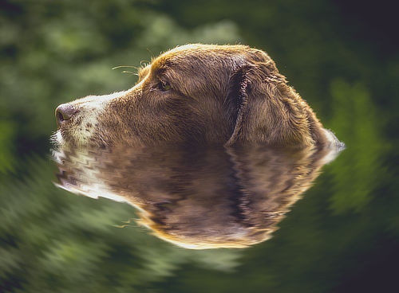

# Mirror

The Mirror filter produces mirror effects ranging from horizontal single-mirror reflections to multi-mirror kaleidoscopes.

*Mirror used with the Ripple and Motion Blur filters to create the impression of a subject submerged in water.*

## About the Mirror filter

This filter can be found in the **Filters** menu, in the **Distort** category.

> **Note:** Click and drag on the image to move the reflection point from its default position.

### Settings

The following settings can be adjusted in the filter dialog:

- **Number of mirrors**—Sets the number of mirror for image reflections.
- **Input**—Rotates the original image and reflection about a rotation point in opposite directions.
- **Output**—Further rotates the mirrored image by a chosen degree.

#### SEE ALSO:

- [Applying filters](../01-applying-filters.md)
