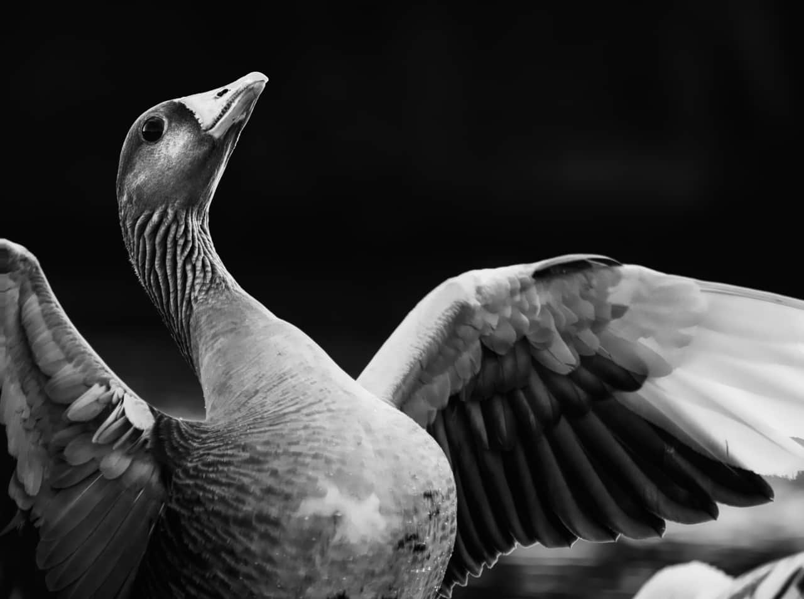

# Pinch/Punch

The Pinch/Punch filter can be used either in small amounts to correct or enhance portraits, or in extreme amounts to create bizarre effects.

Pinch creates a concave spherical distortion (squeezes an area) and Punch creates convex spherical distortion (bulges an area).

## About the Pinch/Punch filter

This filter can be applied as a [non-destructive, live filter](../../06-layers/08-using-live-filters.md). It can be accessed via the **Layer** menu, from the **New Live Filter Layer** category.

> **Note:** Drag on the image to set the origin.

### Settings

The following settings can be adjusted in the filter dialog:

- **Pinch/Punch**—sets the type and value of the distortion. Negative values give a pinch effect, positive values give a punch effect. Type directly in the text box or drag the slider to set the value.
- **Radius**—controls intensity of the filter. Type directly in the text box or drag the slider to set the value.

#### SEE ALSO:

- [Using live filters](../../06-layers/08-using-live-filters.md)
- [Applying filters](../01-applying-filters.md)
- [Twirl](18-filter-twirl.md)
- [Spherical](17-filter-spherical.md)
- [Ripple](15-filter-ripple.md)
