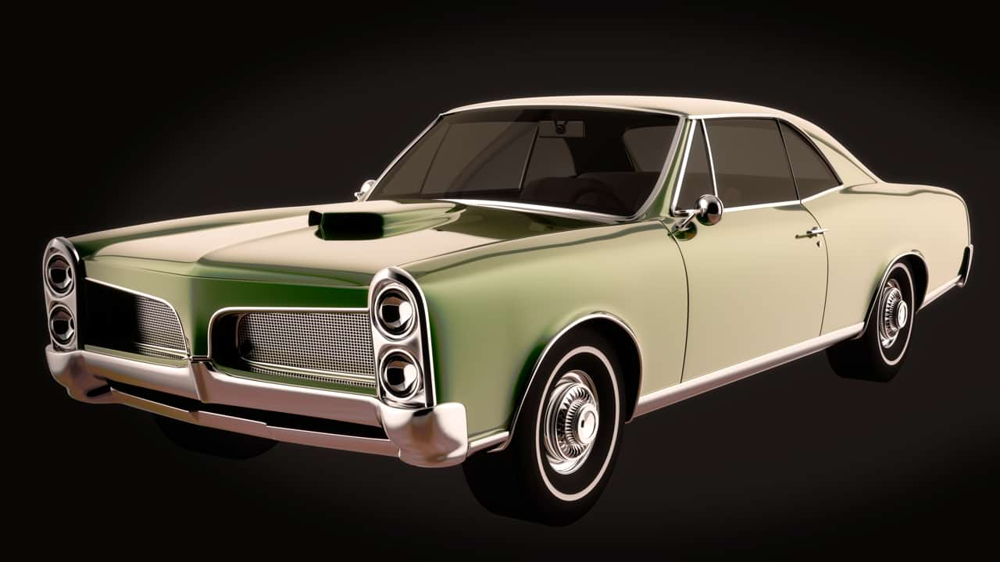
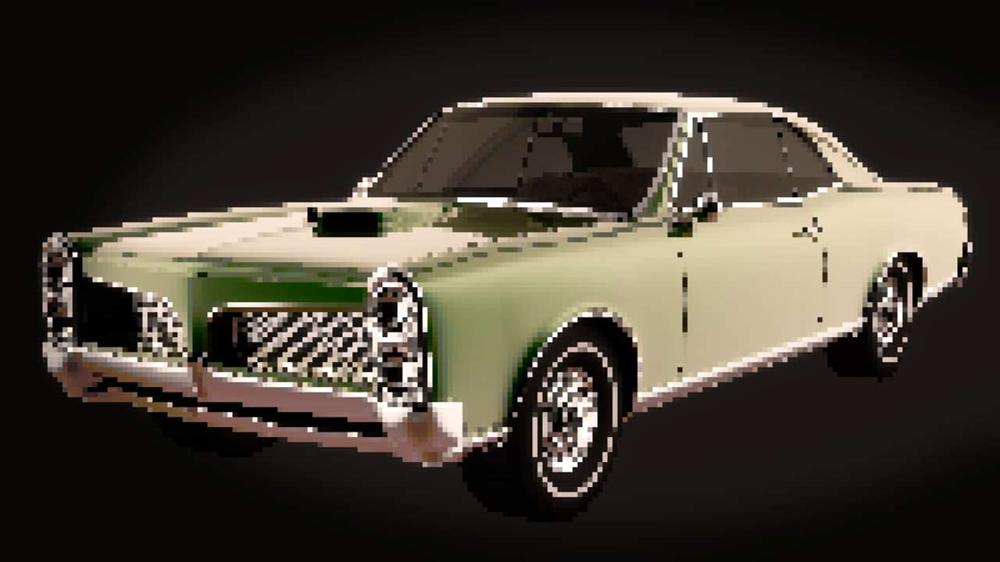

# Pixelate

The Pixelate filter creates blocks of uniform color. The filter is especially useful when confined within a selection area to obscure subject matter.

## About the Pixelate filter

This filter can be found in the **Filters** menu, in the **Distort** category.

### Settings

The following settings can be adjusted in the filter dialog:

- **Quantization**—controls the size of the generated blocks. Type directly in the text box or drag the slider to set the value.

#### SEE ALSO:

- [Applying filters](../01-applying-filters.md)
- [Average](../02-blur-filters/03-filter-average.md)
