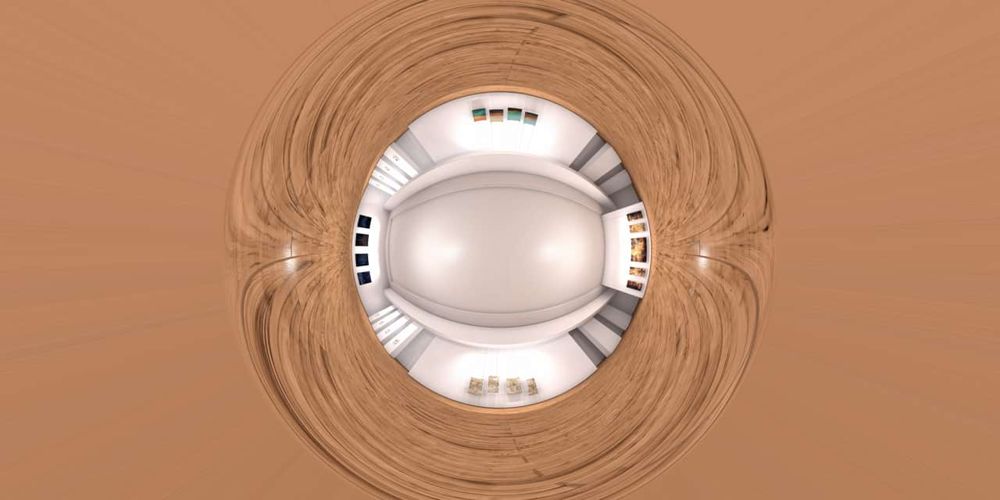
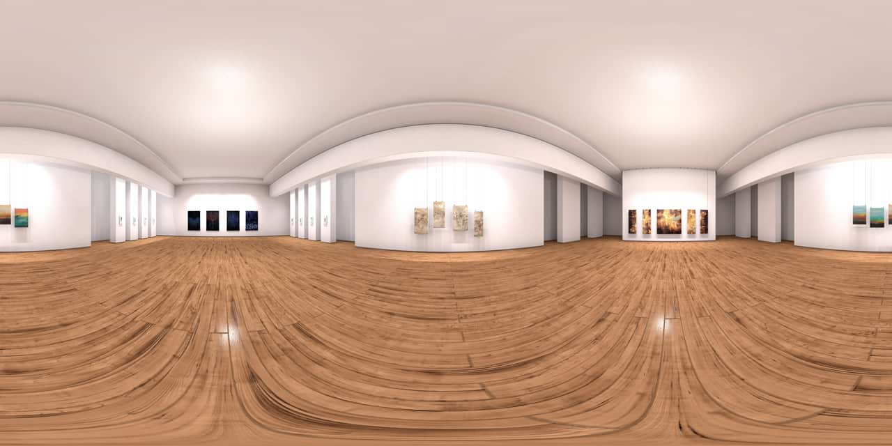

# Polar to Rectangular

The Polar to Rectangular filter converts an image from polar coordinates to rectangular coordinates. This means that a circle can be turned into a straight line.

## About the Polar to Rectangular filter

This filter can be found in the **Filters** menu, in the **Distort** category.

This filter has no customizable settings.

#### SEE ALSO:

- [Applying filters](../01-applying-filters.md)
- [Rectangular to Polar](14-filter-rectangulartopolar.md)
