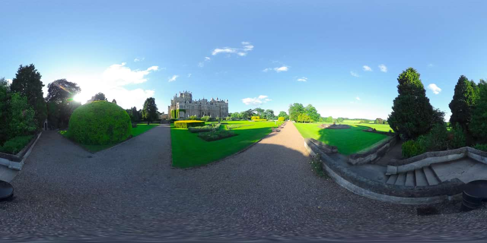
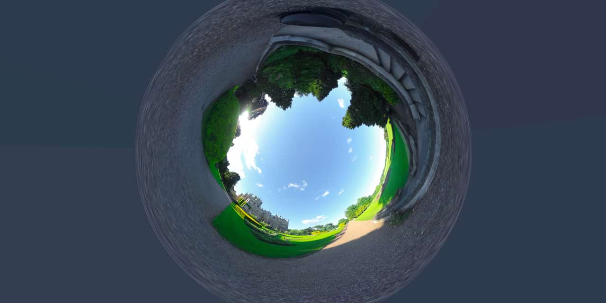

# Rectangular to Polar

The Rectangular to Polar filter converts your image from rectangular coordinates to polar coordinates. This means that horizontal lines can be turned into circles, sunburst effects can be created, and various other effects. It's a handy effect if you want to create a circular frame from a rectangular border.

## About the Rectangular to Polar filter

This filter can be found in the **Filters** menu, in the **Distort** category.

This filter has no customizable settings.

> **Note:** This filter can also be used to create a cylinder anamorphosis—an art form popular in the 18th century. When viewed in a mirrored cylinder, the distorted image appears completely normal!

#### SEE ALSO:

- [Applying filters](../01-applying-filters.md)
- [Polar to Rectangular](13-filter-polartorectangular.md)
