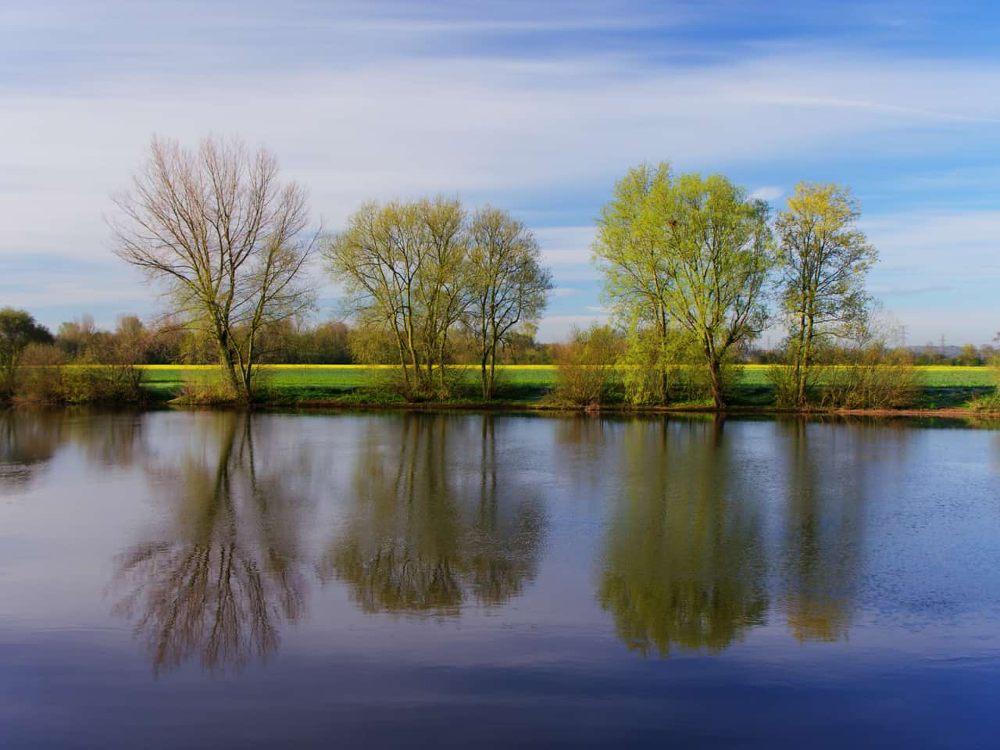

# Ripple

The Ripple filter adds a watery, undulating pattern, like ripples on the surface of a pond.

*The Ripple filter used to achieve a unique effect.*

## About the Ripple filter

This filter can be applied as a [non-destructive, live filter](../../06-layers/08-using-live-filters.md). It can be accessed via the **Layer** menu, from the **New Live Filter Layer** category.

> **Note:** Drag on the image to set the origin.

### Settings

The following settings can be adjusted in the filter dialog:

- **Intensity**—controls the extent of the effect. Type directly in the text box or drag the slider to set the value.

#### SEE ALSO:

- [Using live filters](../../06-layers/08-using-live-filters.md)
- [Applying filters](../01-applying-filters.md)
- [Twirl](18-filter-twirl.md)
- [Pinch/Punch](11-filter-pinchpunch.md)
- [Spherical](17-filter-spherical.md)
