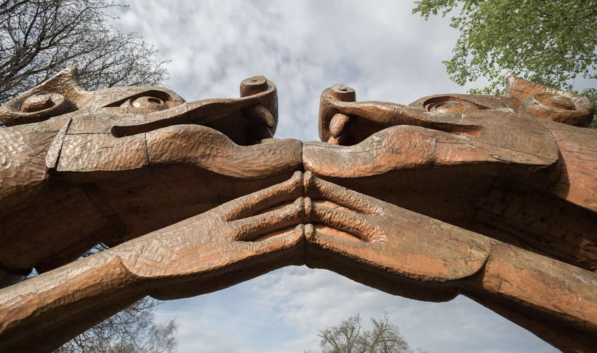

# Shear

The Shear filter applies distortion according to customizable linear or curved graphs. Horizontal and/or vertical shearing is possible via separate graphs.

## About the Shear filter

The graphs are set and modified in the filter dialog. They can apply linear shearing by moving end nodes in the graph only. Shearing to a curve is possible by reshaping the line.

This filter can be found in the **Filters** menu, in the **Distort** category.

### Settings

The following settings can be adjusted in the filter dialog:

- Horizontal/Vertical shear graph (left/right): Move end nodes horizontally or vertically (for linear shearing), or click along the graph's line and move the added node to reshape the curve (for curve shearing). For the latter, add more nodes if needed for more complex curved shearing.

#### SEE ALSO:

- [Applying filters](../01-applying-filters.md)
- [Displace](03-filter-displace.md)
