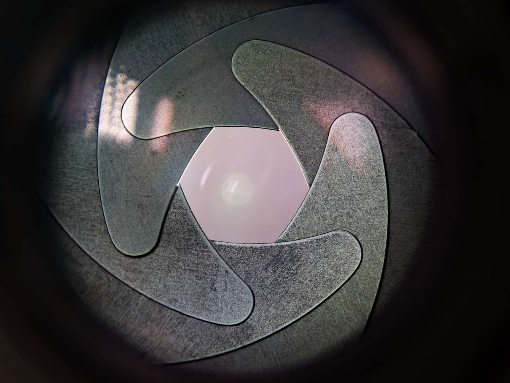
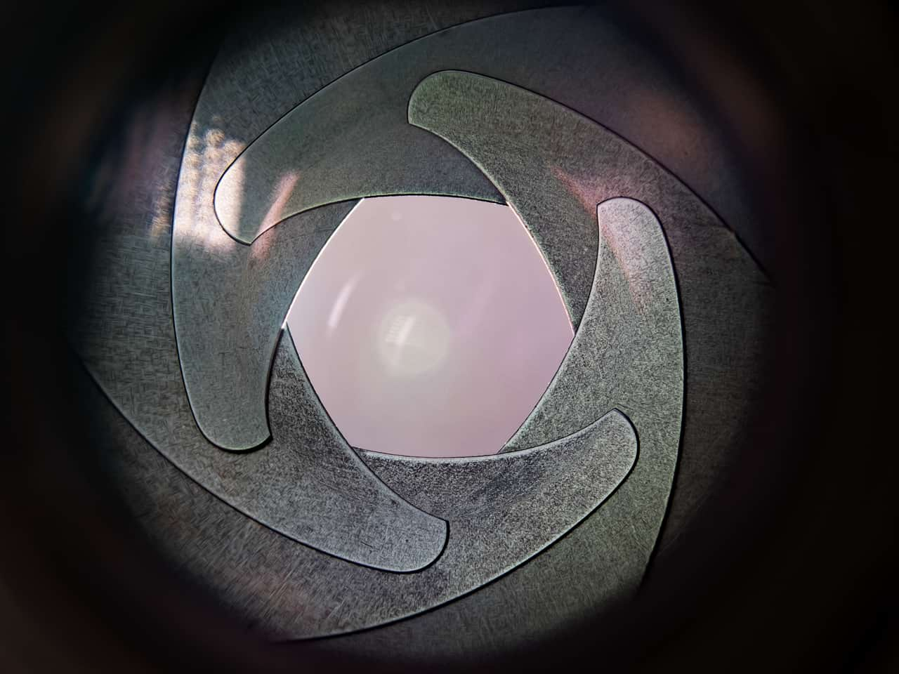

# Spherical

The Spherical filter gives objects the appearance of being wrapped around a spherical shape, distorting the image and stretching it to fit the curve.

*Sharks have good days too!*

## About the Spherical filter

This filter can be applied as a [non-destructive, live filter](../../06-layers/08-using-live-filters.md). It can be accessed via the **Layer** menu, from the **New Live Filter Layer** category.

> **Note:** Drag on the image to set the origin.

### Settings

The following settings can be adjusted in the filter dialog:

- **Intensity**—sets the type and value of the distortion. Negative values give a concave effect, positive values give a convex effect. Type directly in the text box or drag the slider to set the value.
- **Radius**—controls the size of the effect. Type directly in the text box or drag the slider to set the value.

#### SEE ALSO:

- [Using live filters](../../06-layers/08-using-live-filters.md)
- [Applying filters](../01-applying-filters.md)
- [Twirl](18-filter-twirl.md)
- [Pinch/Punch](11-filter-pinchpunch.md)
- [Ripple](15-filter-ripple.md)
