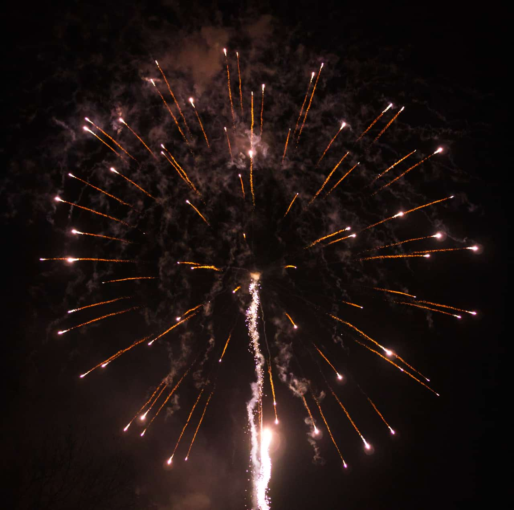
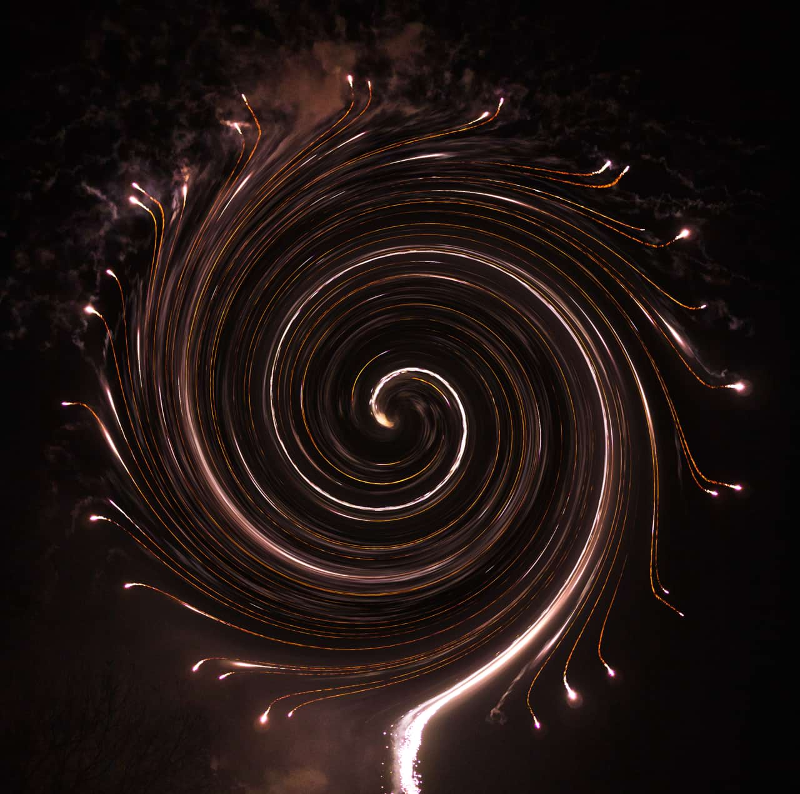

# Twirl

The Twirl filter applies a clockwise or counter-clockwise distortion effect to images.

*The Twirl filter applied to a fireworks photograph.*

## About the Twirl filter

This filter can be applied as a [non-destructive, live filter](../../06-layers/08-using-live-filters.md). It can be accessed via the **Layer** menu, from the **New Live Filter Layer** category.

> **Note:** Drag on the image to set the origin.

### Settings

The following settings can be adjusted in the filter dialog:

- **Angle**—sets the type and value of the distortion. Negative values give a counter-clockwise effect, positive values give a clockwise effect. Type directly in the text box or drag the slider to set the value.
- **Radius**—changes the number of pixels affected. Type directly in the text box or drag the slider to set the value.

#### SEE ALSO:

- [Using live filters](../../06-layers/08-using-live-filters.md)
- [Applying filters](../01-applying-filters.md)
- [Pinch/Punch](11-filter-pinchpunch.md)
- [Spherical](17-filter-spherical.md)
- [Ripple](15-filter-ripple.md)
