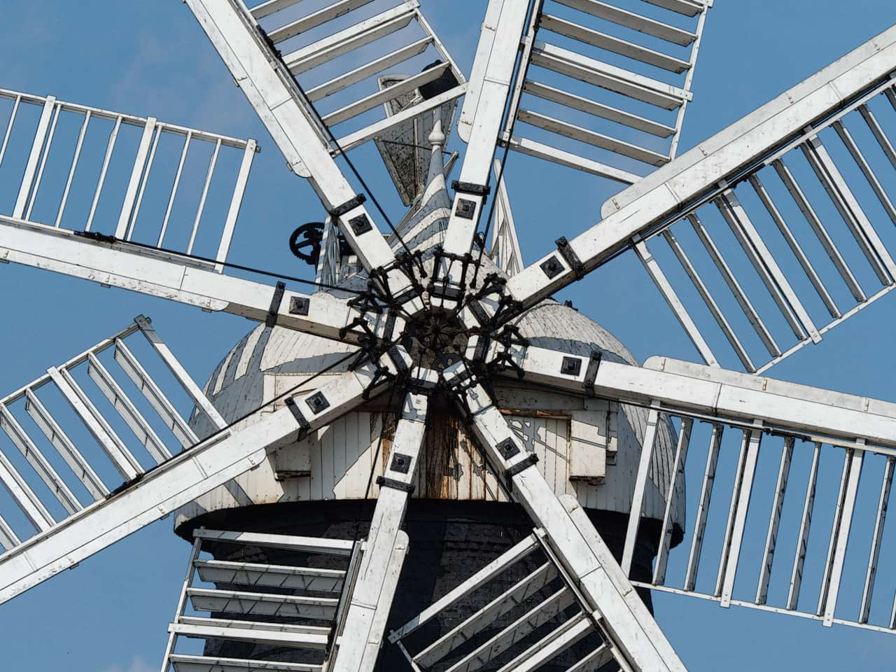

# Detect Edges

The Detect Edges filter isolates and strengthens both horizontal and vertical edges while darkening the rest of the image. It is useful for creating stylized effects and edge masks.

*Detect Edges used on a duplicate layer whose blending mode is then set to "Subtract", giving a cell shaded look.*

## About the Detect Edges filter

This filter can be found in the **Filters** menu, in the **Detect** category.

This filter has no customizable settings.

> **Note:** This filter works by detecting changes in RGB values. It is most useful when used in conjunction with blending modes and masks for other filters and adjustments.

#### SEE ALSO:

- [Applying filters](../01-applying-filters.md)
- [Detect Horizontal Edges](02-filter-detecthorizontaledges.md)
- [Detect Vertical Edges](03-filter-detectverticaledges.md)
