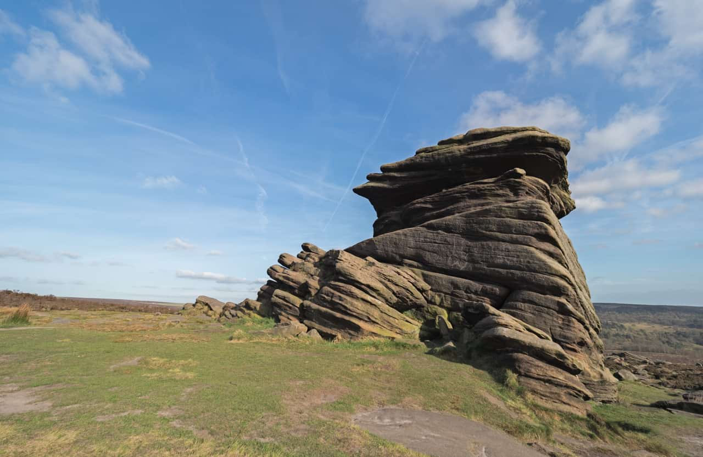
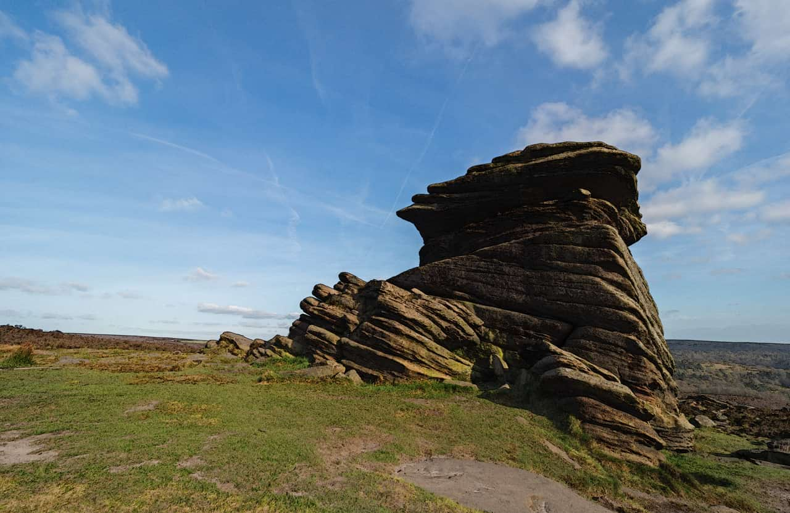

# Detect Horizontal Edges

The Detect Horizontal Edges filter isolates and strengthens horizontal edges while darkening the rest of the image. It is useful for creating stylized effects and edge masks.

*Detect Horizontal Edges filter with Pin Light blend mode applied.*

## About the Detect Horizontal Edges filter

This filter can be found in the **Filters** menu, in the **Detect** category.

This filter has no customizable settings.

> **Note:** This filter works by detecting changes in RGB values. This means that some images will work better than others.

#### SEE ALSO:

- [Applying filters](../01-applying-filters.md)
- [Detect Edges](01-filter-detectedges.md)
- [Detect Vertical Edges](03-filter-detectverticaledges.md)
