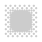

# Noise filters

Noise filters can be used to reduce or add noise (graininess) to your photo.

Filters are applied to your image from the **Filters** menu (destructive) or **Layer** menu (non-destructive) and mostly include customizable settings alongside general options. Non-destructive filters are called live filters, and, once applied, they can be identified as both a filter and a specific filter type by using unique symbols.

| Filter name | Description | Regular filter    (destructive) | Live filter    (non‑destructive) with layer symbol |
| --- | --- | --- | --- |
| [Add Noise](06-noise-filters/01-filter-addnoise.md) | Introduces noise to recreate natural texture. |  |   |
| [Deinterlace](06-noise-filters/02-filter-deinterlace.md) | Converts field based video images to progressive images. |  |  |
| [Denoise](06-noise-filters/03-filter-denoise.md) | Reduces luminance and color noise. |  |   |
| [Diffuse](06-noise-filters/04-filter-diffuse.md) | Adds noise to image edges. |  |   |
| [Dust & Scratches](06-noise-filters/05-filter-dustscratches.md) | Removes dust and scratch artefacts. |  |   |
| [FFT Denoise](06-noise-filters/06-filter-fftdenoise.md) | Reduces noise using a Fourier Transform algorithm. |  |  |
| [Perlin Noise](06-noise-filters/07-filter-perlinnoise.md) | Creates noise with a cloud-like appearance. |  |  |

#### SEE ALSO:

- [Astrophotography filters](01-applying-filters/01-astrofilters.md)
- [Blur filters](02-blur-filters.md)
- [Color filters](03-color-filters.md)
- [Distortion filters](04-distortion-filters.md)
- [Edge detection filters](05-edge-detection-filters.md)
- [Sharpen filters](07-sharpen-filters.md)
- [Tonal filters](01-applying-filters/02-tonalfilters.md)
