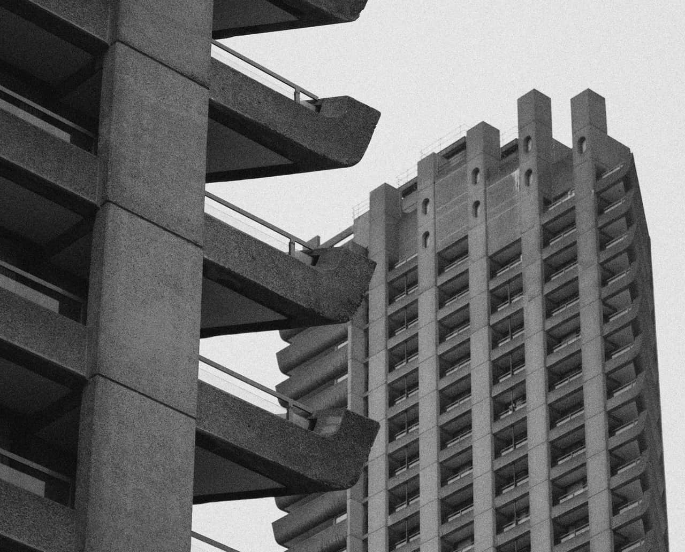

# Add Noise

All digital images have a certain level of noise (random pixel distribution) which helps to create atmosphere, texture, and depth. After image manipulation, such as resizing, cloning, applying gradients, etc., this texture noise is often lost and the image can take on a very flat appearance. The Add Noise filter adds random pixels to the image, introducing a level of noise to help return the textures in the image. This also helps to seamlessly blend effects.

## About the Add Noise filter

This filter can be applied as a [non-destructive, live filter](../../06-layers/08-using-live-filters.md). It can be accessed via the **Layer** menu, from the **New Live Filter Layer** category.

### Settings

The following settings can be adjusted in the filter dialog:

- **Intensity**—controls the level of noise generated. Type directly in the text box or drag the slider to set the value.
- **Monochromatic**—When checked, only tones in the image are affected.
- Noise distribution type:
  - **Uniform**—produces completely random noise distribution. It is often best used in color images.
  - **Gaussian**—produces a wider range of light and dark pixels as it uses a special curve to generate the noise. It's often the best choice for grayscale images.

#### SEE ALSO:

- [Using live filters](../../06-layers/08-using-live-filters.md)
- [Applying filters](../01-applying-filters.md)
- [Denoise](03-filter-denoise.md)
- [Diffuse](04-filter-diffuse.md)
- [Perlin Noise](07-filter-perlinnoise.md)
