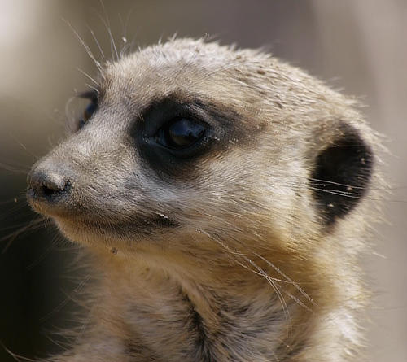
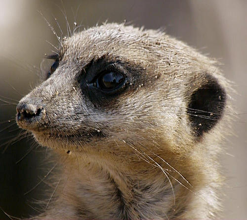

# Deinterlace

The Deinterlace filter removes the line "combing" effect found in images taken from interlaced video streams. It takes either the even (top) or odd (bottom) set of fields and interpolates the other set to produce a whole, progressive image.

*Before and after deinterlacing of an interlaced video frame.*

## About the Deinterlace filter

This filter can be found in the **Filter** menu, in the **Noise** category. There are two further options, **Even Rows** and **Odd Rows**.

### Even/Odd Row selection

- **Even Rows**: The odd (bottom) row fields will be discarded and the image will be interpolated from the even (top) row fields. Use typically if your source is in the NTSC format or in 1080i50/1080i60 (HD).
- **Odd Rows**: The even (top) row fields will be discarded and the image will be interpolated from the odd (bottom) row fields. Use typically if your source is in PAL DV (tape-based camcorders).

#### SEE ALSO:

- [Applying filters](../01-applying-filters.md)
