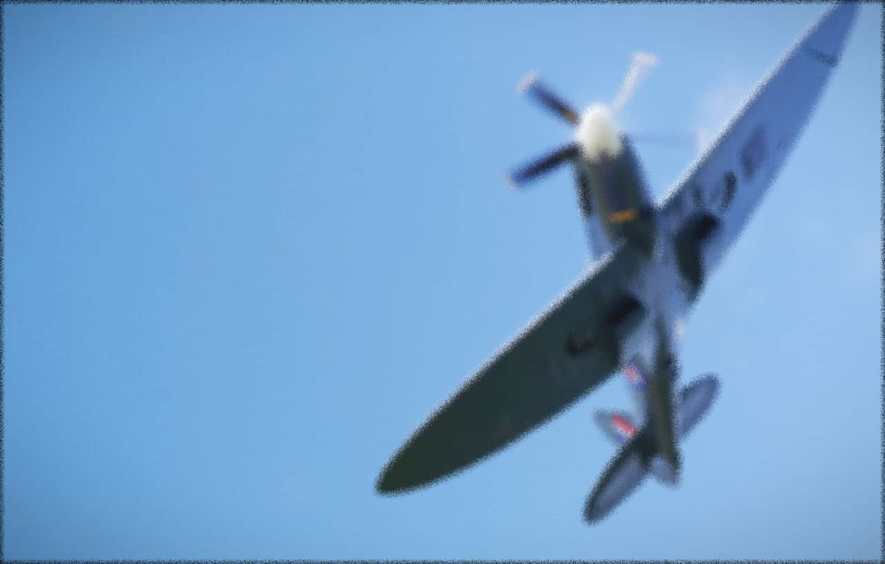

# Diffuse

The Diffuse filter adds noise to the edges in the image (or selection).

## About the Diffuse filter

This filter can be applied as a [non-destructive, live filter](../../06-layers/08-using-live-filters.md). It can be accessed via the **Layer** menu, from the **New Live Filter Layer** category.

### Settings

The following settings can be adjusted in the filter dialog:

- **Intensity**—controls the level of noise generated. Type directly in the text box or drag the slider to set the value.

#### SEE ALSO:

- [Using live filters](../../06-layers/08-using-live-filters.md)
- [Applying filter](../01-applying-filters.md)
- [Denoise](03-filter-denoise.md)
- [Add Noise](01-filter-addnoise.md)
- [Perlin Noise](07-filter-perlinnoise.md)
