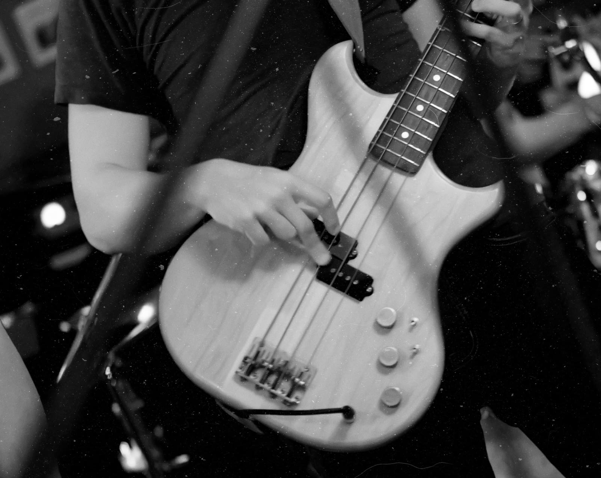

# Dust & Scratches

The Dust & Scratches filter removes artefacts like dust and scratch marks from your images by mapping out dissimilar pixels.

This filter can be applied as a [non-destructive, live filter](../../06-layers/08-using-live-filters.md). It can be accessed via the **Layer** menu, from the **New Live Filter Layer** category.

### Settings

The following settings can be adjusted in the filter dialog:

- **Radius**—controls the size threshold for determining dust and scratch artefacts. If the artefacts are mainly fine in detail, use a smaller radius. Larger radius values will tackle larger artefacts.
- **Tolerance**—determines how aggressively the filter should analyze the image. Increase the slider to reduce the amount of the image that the filter will affect.
- **Channel Tolerance**—when checked, the **Tolerance** slider works on a per-channel basis. Useful for color images as it can produce smoother results and fewer artefacts.

> **Tip:** If you are struggling to remove all dust and scratch marks while maintaining a sharp image, don't forget that you can use the **Undo Brush Tool** to remove the effect from areas where you want to retain detail.

#### SEE ALSO:

- [Applying filters](../01-applying-filters.md)
- [Denoise](03-filter-denoise.md)
