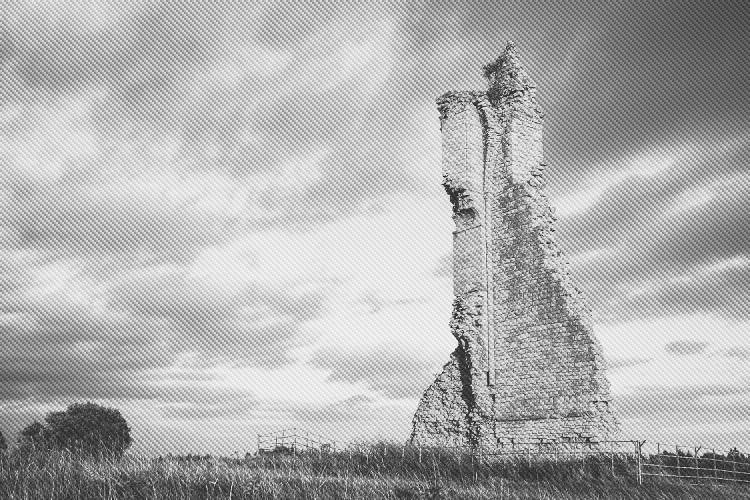
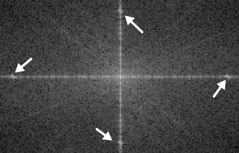

# FFT Denoise

The FFT denoise filter (Fast Fourier Transform) removes periodic noise from scanned images.

## About the FFT Denoise filter

Periodic noise is encountered on scanned images when the scanner has been subject to electrical or electromagnetic interference. By using a grayscale Fourier spectrum generated from the image, periodic noise peaks can be edited out of the spectrum by using a brush.

*Paired noise peaks on Fourier spectrum mirrored across both horizontal and vertical lines.*

This filter can be found in the **Filters** menu, in the **Noise** category.

### Settings

The following settings can be adjusted in the Fourier spectrum:

- **Width**—the brush (stroke) size in pixels. Type directly in the text box or drag the pop-up slider to set the value.
- **Opacity**—how see-through the brush is. 100% opacity erases pixels completely on the first pass. A lower opacity only partially erases the peaks.
- **Flow**—how fast the brush effect is applied (1% is very slow, 100% is immediate). Type directly in the text box or drag the pop-up slider to set the value.
- **Hardness**—how hard the edges of the brush are. The brush appears softer as the percentage decreases. Type directly in the text box or drag the pop-up slider to set the value.
- **More**—click to display the [Brushes](../../23-painting-and-erasing/06-modifying-brushes.md) dialog to access advanced brush settings.

**To remove periodic noise:**

- From the grayscale Fourier spectrum, select brush properties from the top toolbar. Take care to set a brush width that encompasses the noise peaks entirely.
- Paint out the frequency noise pairings on both horizontal and vertical lines.

> **Note:**
>
> **macOS:**
>
> Use your `Alt`  to zoom in/out of areas of the spectrum.
>
> **Windows:**
>
> Use your `Cmd`  to zoom in/out of areas of the spectrum.

#### SEE ALSO:

- [Applying filters](../01-applying-filters.md)
- [Denoise](03-filter-denoise.md)
