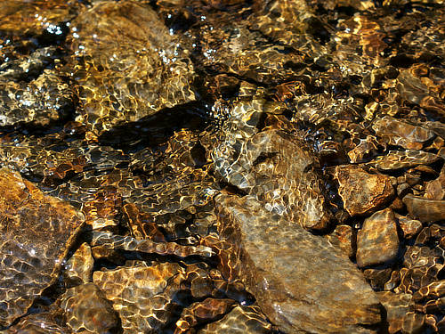
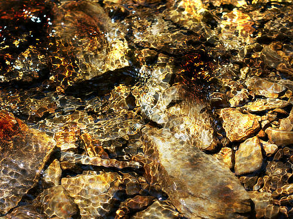

# Perlin Noise

Perlin noise generates pixels with values that vary between the foreground and background colors, resulting in a cloud pattern. Sometimes known as Clouds or Difference Clouds. It can be used to create realistic looking scalable textures, including cloud, smoke, and rock or earth-like effects, and is a great way of adding realism to textured areas.

*Perlin Noise used to add texture to a photograph using blend modes.*

## About the Perlin Noise filter

This filter can be found in the **Filters** menu, in the **Noise** category.

When the filter is applied, the clouds are generated using the currently selected foreground and background colors. The image data on the active layer is replaced.

> **Note:** If the layer is fully transparent, the filter will not be applied. The layer must have some pixel data.

### Settings

The following settings can be adjusted in the filter dialog:

- **Octaves**—controls the cloud complexity. Type directly in the text box or drag the slider to set the value.
- **Zoom**—controls the zoom level of the clouds and the complexity of the noise. Type directly in the text box or drag the slider to set the value.
- **Persistence**—controls how blurred or grainy the effect is. Type directly in the text box or drag the slider to set the value.
- **Blend mode**—changes how the applied pixels (noise) interact with existing pixels on a layer. Select from the pop-up menu.

> **Tip:** You can create marble textures and other interesting patterns by applying the filter several times using a Difference blend mode.

#### SEE ALSO:

- [Applying filters](../01-applying-filters.md)
- [Denoise](03-filter-denoise.md)
- [Add Noise](01-filter-addnoise.md)
- [Diffuse](04-filter-diffuse.md)
