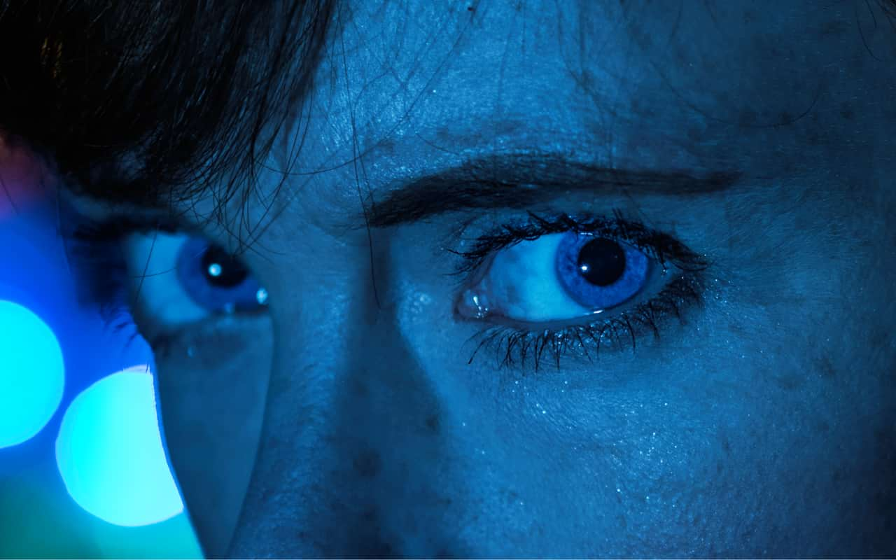
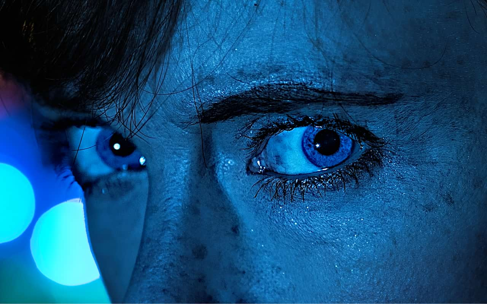

# High Pass

The High Pass filter retains details where sharp color transitions occur, generally at the edges, and suppresses the rest of the image.

*High Pass filter applied with an Overlay blend mode for sharpening.*

## About the High Pass filter

When a High Pass filter is applied at a high radius value to a duplicate layer and combined with a contrast blend mode (such as overlay, soft light or hard light), it can be used as a useful sharpening technique.

This filter can be applied as a [non-destructive, live filter](../../06-layers/08-using-live-filters.md). It can be accessed via the **Layer** menu, from the **New Live Filter Layer** category.

### Settings

The following settings can be adjusted in the filter dialog:

- **Radius**—controls how many pixels are kept and how many are suppressed. (At higher radius values, only edge pixels are kept.)
- **Monochrome**—when selected, the final effect only contains grayscale values.

#### SEE ALSO:

- [Using live filters](../../06-layers/08-using-live-filters.md)
- [Applying filters](../01-applying-filters.md)
- [Unsharp Mask](02-filter-unsharpmask.md)
- [Clarity](../09-shadows-highlights/01-filter-clarity.md)
