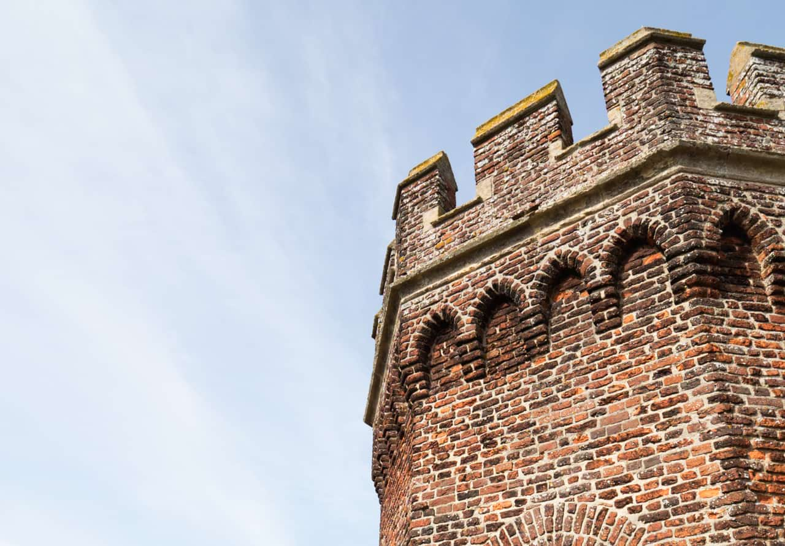
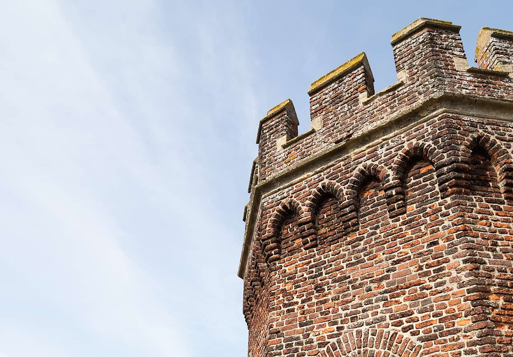

# Unsharp Mask

In spite of its misleading name, the Unsharp Mask filter is a flexible and powerful way to increase apparent sharpness in an image.

*Unsharp Mask can be used to add punch to an image, or to help sharpen soft images.*

## About the Unsharp Mask filter

This filter can be applied as a [non-destructive, live filter](../../06-layers/08-using-live-filters.md). It can be accessed via the **Layer** menu, from the **New Live Filter Layer** category.

### Settings

The following settings can be adjusted in the filter dialog:

- **Radius**—controls the number of pixels affected around the existing light pixels. A smaller radius enhances smaller scale detail. Type directly in the text box or drag the slider to set the value. Dragging to the right on the page allows you to override the maximum value—values above 100 px may affect performance so use with care.
- **Factor**—controls how much contrast is added. Type directly in the text box or drag the slider to set the value.
- **Threshold**—controls how much contrast there needs to be between colors before the sharpening effect 'kicks in'. Use higher values for grainy images or skin tones.

> **Tip:** The Unsharp Mask filter affects the whole image (or selection). For fine control, it can be useful to apply it to a separate duplicate layer(s), and then either use a mask to allow sharpening of only specific areas, or use blends modes set to lighten/darken and change the opacity of these layers to get the effect that you want.

#### SEE ALSO:

- [Using live filters](../../06-layers/08-using-live-filters.md)
- [Applying filters](../01-applying-filters.md)
- [Clarity](../09-shadows-highlights/01-filter-clarity.md)
- [High Pass](01-filter-highpass.md)
