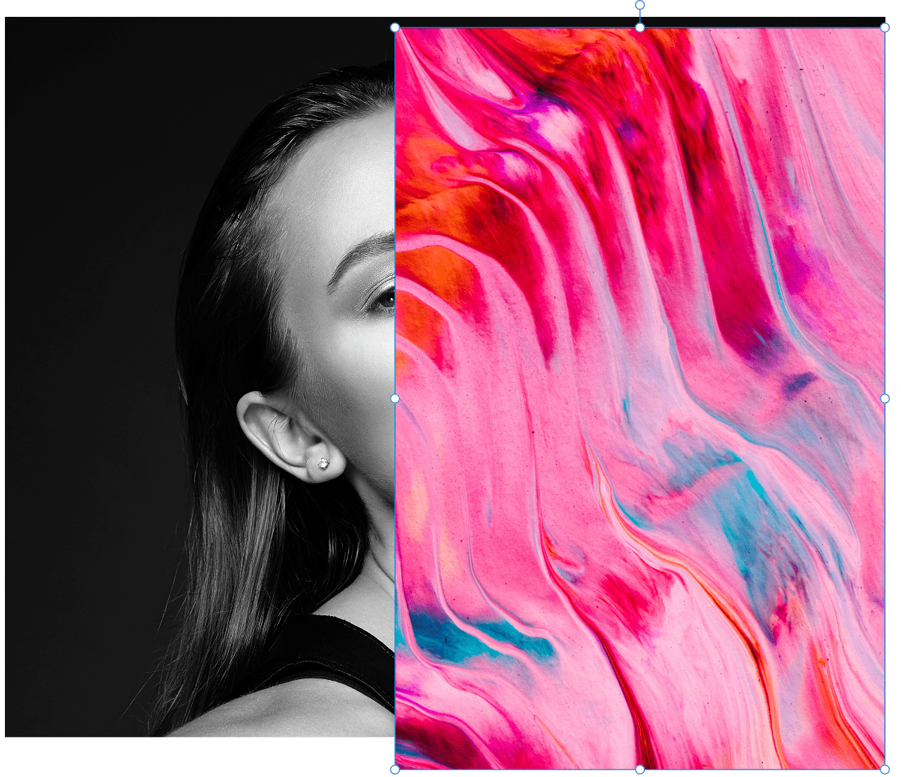
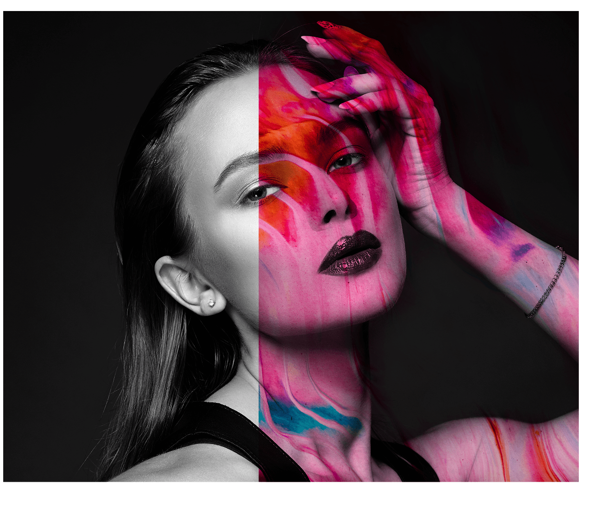
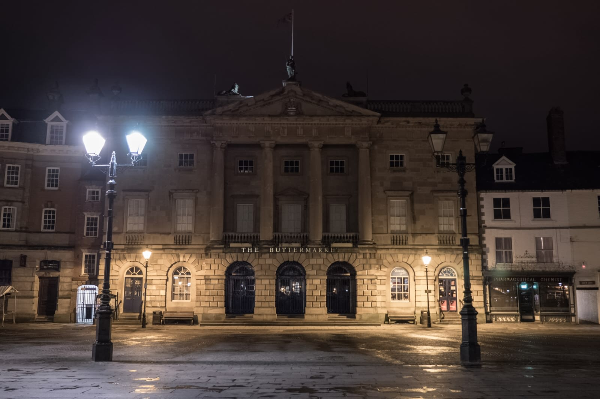
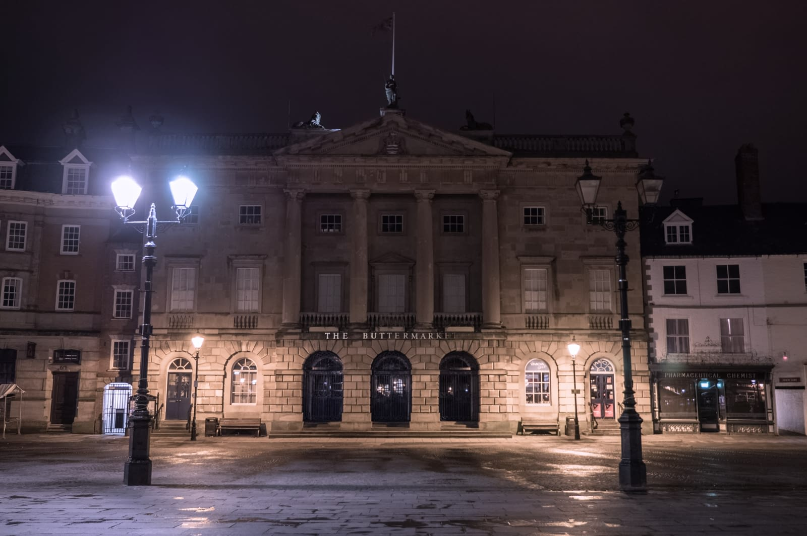

# Apply Image

Apply Image lets you composite images together on the same layer and use a number of expressions for advanced channel blending.

*Blending a fashion model's photo with a transparent overlay.*

## About Apply Image

Apply Image lets you blend a layer from a source image into a target image's layer. The images are composited into a single layer. Channel expressions and blend modes are available to composite the layers.

The source image can be scaled automatically to the target image horizontally, vertically or both, avoiding having to size the images equally first.

**To blend two images:**

1. Open your target image.
2. From the **Layers** panel, select the layer that you want to blend the source image with.
3. From the **Filters** menu, select **Apply Image**.
4. Click **Load Image** and navigate to, then select the source image to import. If the image is another layer within your document, you can also click-drag it onto the dialog box to use it.
5. (Optional) Check the **Equations** option in order to enable channel blending.
6. (Optional) Set the **Opacity** level to control how transparent the imported image appears.
7. (Optional) Select a **Blend Mode** to alter how the source image's colors blends with the target image. Select from the pop-up menu.
8. (Optional) Uncheck **Scale Horizontal To Fit** to retain the imported images native width. When checked, the image is stretched/shrunk to the main image. Uncheck **Scale Vertical To Fit** to retain native height.
9. Click **Apply**.

**To use channel expressions:**

1. With the **Apply Image** dialog open, either load an image or choose **Use Current Layer As Source** to blend the image with itself.
2. Check the **Equations** option in order to enable channel blending.
3. Choose a color space to blend in with the **Equation Color Space** pop-up menu.
4. Now use the available expressions to blend channel information. Some expressions include:
  - Use **D**+**Channel** to specify a destination image channel (the original layer). E.g., **DB** for **Destination Blue** channel.
  - Use **S**+**Channel** to specify a source image channel (the image you have loaded in). E.g., **SR** for **Source Red** channel.
  - Use +, -, *, / to add, subtract, multiply or divide respectively. E.g., **SR/SG*SB** to divide **Source Red** by **Source Green** and then multiply by **Source Blue**.

*Removing a yellow color cast using channel expressions.*

#### SEE ALSO:

- [Layer blending](../06-layers/05-layer-blending.md)
