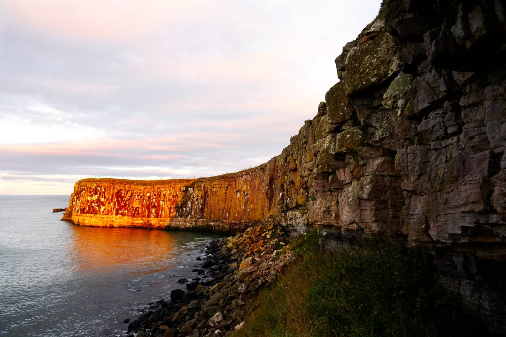
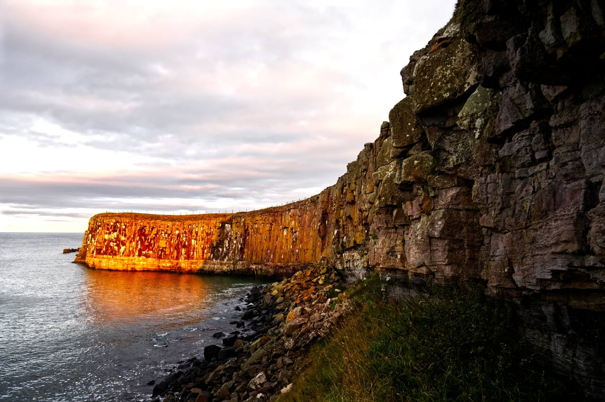

# Clarity

The Clarity filter enhances the local contrast in an image. Its greatest influence is in the mid-tonal range. This results in a sharpening effect.

*Using the Clarity filter to accentuate the outline and details of the image's subject.*

## About the Clarity filter

This filter can be applied as a [non-destructive, live filter](../../06-layers/08-using-live-filters.md). It can be accessed via the **Layer** menu, from the **New Live Filter Layer** category.

In Develop Persona, this filter is available on the **Basic** panel (Enhance).

### Settings

The following settings can be adjusted in the filter dialog:

- **Strength**—controls the intensity of the filter. Type directly in the text box or drag the slider to set the value.

> **Note:** Setting the value via a text box is not available in Develop Persona.

#### SEE ALSO:

- [Using live filters](../../06-layers/08-using-live-filters.md)
- [Applying filters](../01-applying-filters.md)
- [Unsharp Mask](../07-sharpen-filters/02-filter-unsharpmask.md)
- [High Pass](../07-sharpen-filters/01-filter-highpass.md)
- [Developing a raw image](../../04-develop-persona-raw/01-developing-raw-images.md)
