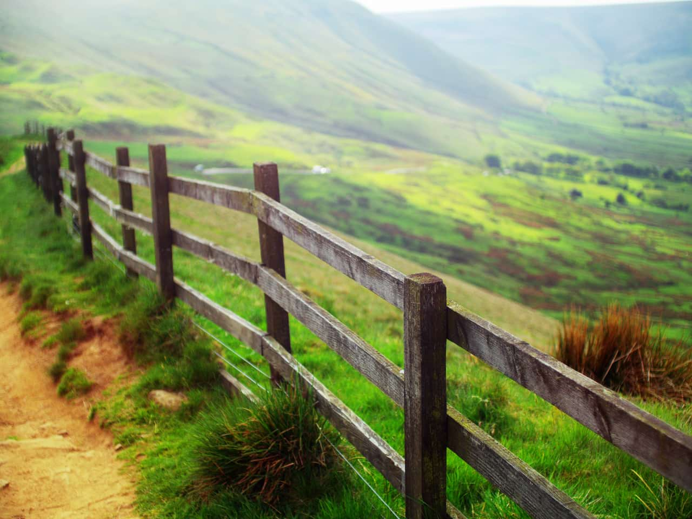
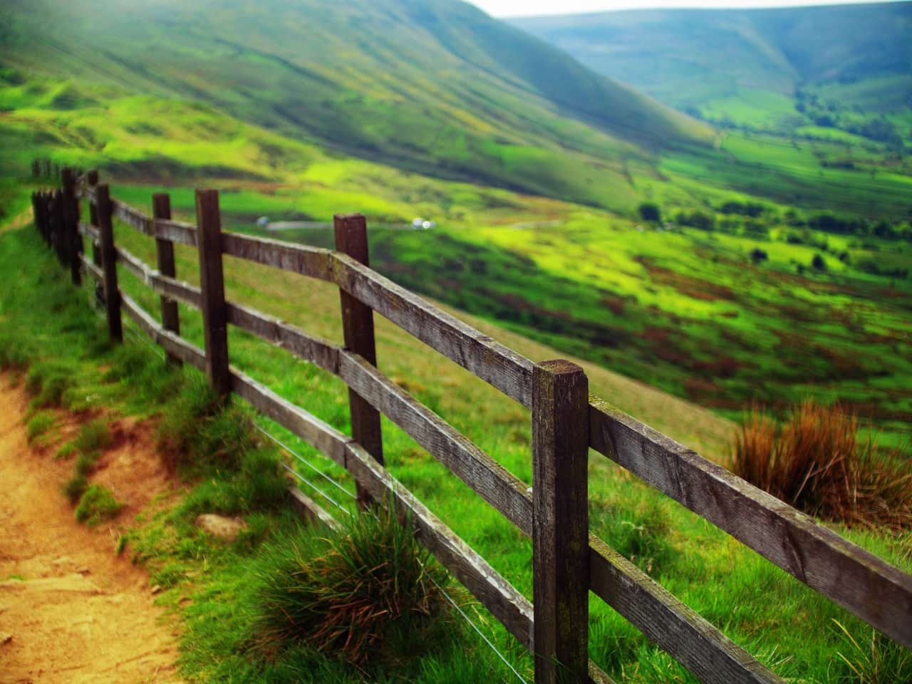

# Haze Removal

*Before and after using Haze Removal.*

## About the Haze Removal filter

This filter can be found in the **Filters** menu.

Haze Removal can remove slight to extreme cases of haze affecting an image. Its most typical use is for landscape photography where the haze causes low contrast and low saturation, but it can also be used to improve images taken during rainy and foggy conditions.

### Settings

The following settings can be adjusted in the filter dialog:

- **Distance**—controls the depth of the haze removal: moving the slider to the right removes haze towards the background of the image.
- **Strength**—specifies how strong the haze removal effect should be. More strength results in more extreme haze removal.
- **Exposure Correction**—allows for correction of the image's exposure: use if haze removal causes underexposure or overexposure.

#### SEE ALSO:

- [Applying filters](01-applying-filters.md)
