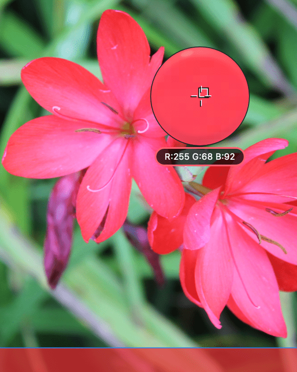

# Sampling (or picking) colors

The act of color picking lets you sample colors within or outside Affinity Photo 2, then use them throughout your design.

### About sampling colors

Color sampling appears in two slightly different forms within Affinity Photo 2. It exists as a 'component' of selected panels as well as a standalone tool.

Both versions function in slightly different ways:

- A color picker appears on the **Color** and **Swatches** panels (and other color-related pop-up panels) in the Photo Persona.
- The standalone **Color Picker Tool** appears on the **Tools** panel in the Photo Persona only.

Regardless of which you use, a sampled color is stored and applied from the swatch next to the color picker's icon on the **Color** or **Swatches** panel.

> **Note — Screen recording permission:** The first time you sample color, your operating system may ask whether to grant permission for your Affinity app to record the screen. If you deny it, you can still sample from the app's windows but not other screen areas. Refer to your operating system's documentation if you need to grant permission at a later time.

**To use the Color Picker Tool:**

1. On the **Tools** panel, select the **Color Picker Tool**.
2. Adjust the settings on the context toolbar.
3. Do one of the following:
  - (For on-page sampling) Click to pick up any color on the page.
  - (For screen-wide 'magnified' sampling) Drag to select any color under a magnifier anywhere within or outside the app.

> **Note:** If **Apply to Selection** is enabled, the sampled color is applied to any currently selected object.

**To use a panel's color picker:**

1. (Optional) Select an object to adopt the picked color on picking.
2. Click the selector you want to apply the color to.
3. Drag the **Color Picker** to the color you want to sample.

> **Note:** Once loaded, the sampled color in the **Color Picker** swatch can be applied to any subsequently selected object by clicking the swatch.

> **Note — Modifier(s):** **macOS:** With brush, shape and gradient tools, you can sample color by dragging with the `Alt`  pressed.
>
> **Windows:** With brush, shape and gradient tools, you can sample color by dragging with the `Alt`  pressed.

#### SEE ALSO:

- [Color Picker Tool](../32-tools/01-photo-editing-tools/03-color-picker-tool.md)
- [Selecting colors](06-selecting-colors.md)
