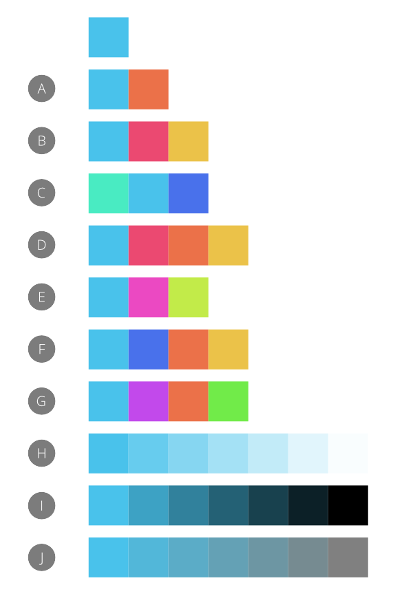

# Color chords

A color chord is a spread of harmonious colors which can be used in conjunction with each other to produce appealing designs.

## About color chords

Color chords are created by first choosing a base color and then picking a chord type (built on professional color theory). A spread of colors is then populated and stored in the current palette in the **Swatches** panel. You can then select from these colors as you design.

*Example color chords created by applying different chord types to the base color in the top row.*

Chord types are based on the HSL color wheel and include:

- (A) **Complementary**—the base color and its opposite on the color wheel.
- (B) **Split Complementary**—the base color and the colors adjacent to its opposite on the color wheel.
- (C) **Analogous**—the base color and the colors adjacent to it on the color wheel.
- (D) **Accented Analogic**—as for Analogous but, like Complementary, also includes the base color's opposite.
- (E) **Triadic**—three colors spaced equally around the color wheel starting from the base color.
- (F) **Tetradic**—four colors arranged around the color wheel in two complementary color pairs, starting from the base color. Otherwise known as 'Rectangle'.
- (G) **Square**—four colors spaced equally around the color wheel starting from the base color.
- (H) **Tints**—colors which vary in lightness from the base color to white.
- (I) **Shades**—colors which vary in lightness from the base color to black.
- (J) **Tones**—colors which vary in saturation from the base color to gray.

> **Tip:** You'll find a wide range of color theory websites on the Internet.

**To create a color chord:**

1. (Optional) On the **Swatches** panel, click Panel Preferences and choose an 'Add Palette' option.
2. Do one of the following:
  - With no content selected, select a color using the **Color** or **Swatches** panel.
  - Select page content with the color you wish to work with. Remember to select the appropriate color selector on the **Color** or **Swatches** panel.
3. On the **Color** panel, click the Panel Preferences menu and select a chord type from the **Add Chord to Swatch** pop-up menu.

#### SEE ALSO:

- [Selecting colors](06-selecting-colors.md)
- [Color panel](../33-panels/08-color-panel.md)
- [Swatches panel](../33-panels/27-swatches-panel.md)
