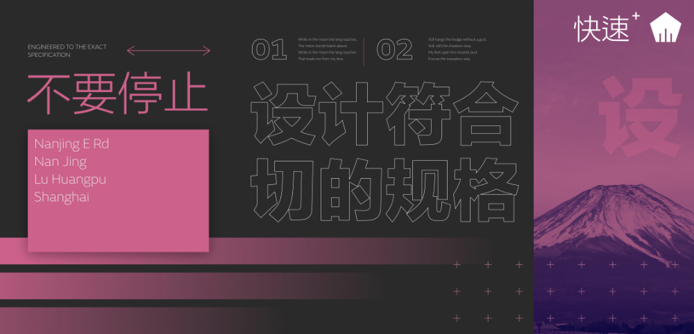
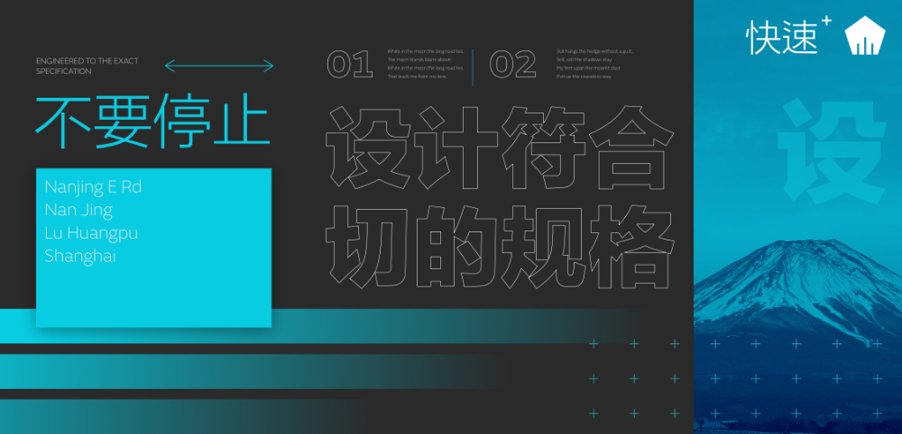

# Global colors

Global colors can be created and applied to different objects in your design. If you want to change the color across your design at a later time, you can simply edit the global color in the Swatches panel and all objects update with the new color automatically and simultaneously.

## About global colors

The global color could be applied as a solid fill, stroke, or a color used in a gradient fill. They can be made while in RGB, CMYK, HSL, LAB, Grayscale, or Tinting color modes.

Global colors are added to the currently selected document palette in the Swatches panel. If a document palette does not exist when your document's first global color is created, a new document palette is automatically created for you in which the color will be stored. Once created, you can apply the global color to your design.

> **Note:**  A global color is indicated by a tab in the bottom-left corner of its color swatch.

> **Tip:** You can check if a global color has been assigned to an object's stroke or fill by using the Color panel.

**macOS:**

> **Note:** If you're [importing a document palette](../../29-add-ons/04-importing-add-ons.md) containing global colors as a System or Application palette, the global colors will be converted to standard colors.

**Windows:**

> **Note:** If you're [importing a document palette](../../29-add-ons/04-importing-add-ons.md) containing global colors as an Application palette, the global colors will be converted to standard colors.

**To create a global color from an existing object:**

Do one of the following:

- Select the object, choose a Document palette in the **Swatches** panel, set the Stroke/Fill color selector, then click **Add current color to palette as a global color**.
- `Click`-click the object and select **Add to Swatches**, then **From Fill as Global**, **From Line as Global** or **From Both as Global** depending on the object property you want to save.

**To create a global color from scratch:**

1. On the **Swatches** panel, select a Document palette from the palette pop-up menu. If no Document palette exists you can create one from the panel's Panel Preferences menu.
2. From **Panel Preferences**, select **Add Global Color**.
3. Adjust the settings in the dialog.
4. Click **Add**.

**To convert an existing color swatch into a global color:**

1. In the **Swatches** panel, choose a Document palette from the pop-up menu.
2. `Click`-click a displayed swatch and select **Make Global**.

> **Note:** If you have objects in your design which had the original color applied, these *will not* be updated to use the global color automatically. You will have to apply the global color manually.

**To edit a global color:**

1. On the Swatches panel, `Click`-click the chosen color swatch and select **Edit Fill**.
2. From the dialog, select a color.

All objects using the global color will be updated automatically.

#### SEE ALSO:

- [Overprinting](03-overprinting.md)
- [Spot colors](02-spot-colors.md)
