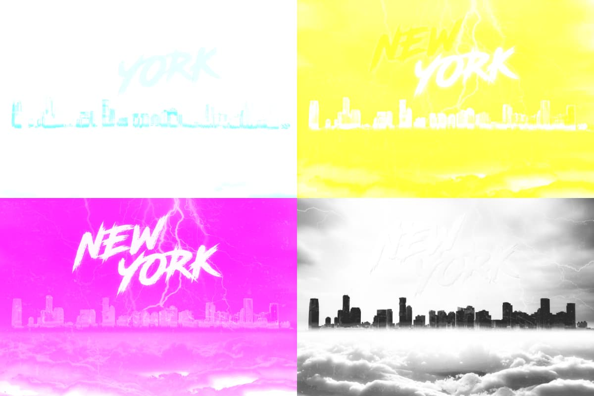

# Using channels

The image or document's color mode determines the number and type of color channels available to you. Each channel stores color information specific to it, which, when combined with other channels, brings about the full color image. For example, a red channel would store only red color information in RGB color mode.

Channel information is displayed in the **Channels** panel.

*The color channels of a CMYK image separated out.*

*The composite of the above image's color channels.*

## Co lour modes and channels

For each color mode, the following channels are available.

- **RGB**: Red, Green, Blue channels
- **CMYK**: Cyan, Magenta, Yellow, Black channels
- **Grayscale**: Intensity channel
- **Lab**: Lightness, AOpponent, BOpponent channels

> **Note:** On new documents, the **Color Format** option presents Color mode and bit depth options in combination.

## Image and layer channels

The Channels panel always displays an image's channels when loaded. From an image channel you can:

- Protect the channel from editing.
- Hide the channel.
- Create a spare channel (i.e., a saved selection) from any channel's information.
- Store a new selection based on the channel information.
- Add, subtract, or intersect a channel's selection to/from/with a previously made selection, respectively.

For any currently selected layer (pixel, mask, adjustment or live filter), the layer's channel(s) are displayed in the bottom part of the panel. From each layer's channel you can:

- Invert, clear, and fill the channel information.
- Create a new grayscale layer.
- Create a new mask layer.
- Create a spare channel (i.e., a saved selection) from the channel information.

## Alpha channels

The **Channels** panel also displays the alpha channel for the whole image or currently selected pixel, mask, adjustment, or live filter layer. These channels store transparency information, so it's a great place for more advanced masking control. For more information, see [Channels panel](../33-panels/06-channels-panel.md).

## Pixel selections

Another great use of alpha channels is the ability to store more complex selections that would otherwise be difficult or time consuming to recreate again. The **Channels** panel reports your current pixel selection as a channel entry, so by creating a 'new' Spare Channel from that pixel selection you've stored the selection for future use. For more information, see [Spare channels](03-spare-channels.md).

## Pixel selections and masks

Because alpha channels store both selection and masks, the **Channels** panel acts as a great central point for working between masks and selections. For more information, see [Masking from channels](04-masking-from-channels.md).

## Blend ranges

You can control how specific color channels of the current layer blend with the underlying layer(s). For more information, see [Layer blend ranges](../06-layers/06-layer-blend-ranges.md).

#### SEE ALSO:

- [Channels panel](../33-panels/06-channels-panel.md)
- [Spare channels](03-spare-channels.md)
- [Color models](../12-color/02-color-models.md)
- [Saving and loading selections](../08-selections/08-saving-and-loading-selections.md)
- [Layer masks](../06-layers/12-layer-masks.md)
- [Edit selection as layer using Quick Mask](../08-selections/04-edit-selection-as-layer-using-quick-mask.md)
- [Pixel selections from channels](../08-selections/01-creating-pixel-selections/07-from-channels.md)
