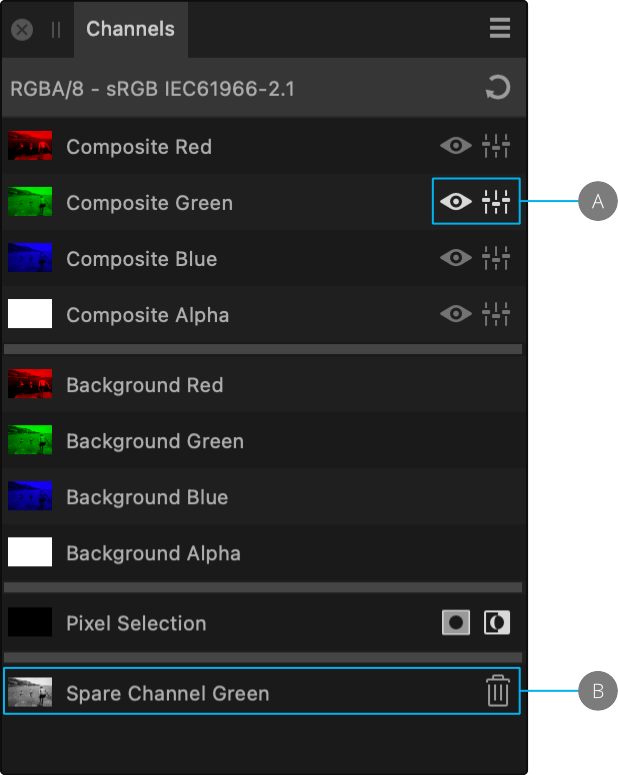

# Editing channels

You can select one or more channels for further editing. The selected channel ready for editing is indicated on the panel by both the **Visible** as well as the **Editable** icons.

*(A) Composite Green channel selected and editable. (B) Spare Channel created and renamed.*

## About editing channels

The Channels panel displays a list of channels based on current document information and available for editing. Pixel Selection will always appear at the bottom of the panel even when no selection is active.

**To hide/show channels:**

Do one of the following:

- From the **Channels** panel, click **Visible** on the channel entry.
- From the **Channels** panel, -click the channel you wish to target and select **Toggle Visible** from the pop-out menu.

**To protect channels from editing:**

Do one of the following:

- From the **Channels** panel, click **Editable** on the channel entry. A grayed out icon means the channel is no longer editable.
- From the **Channels** panel, -click the channel you wish to target and select **Toggle Editable** from the pop-out menu.

## Editing spare channels

The spare channel that stores your mask can be isolated for editing. This lets you paint and erase directly on the spare channel, as well as apply filters such as Gaussian Blur for softer mask edges.

**To edit individual channels:**

1. From the **Channels** panel, `Click`-click each of the **Background** channels in turn and select **Create Spare Channel**.
2. (Optional) Rename the newly created spare channels.
3. `Click`-click the spare channel entry to isolate it and select **Load to Pixel Selection**.
4. (Optional) Select another spare channel and `Click`-click and select **Subtract From Pixel Selection**. This helps if there is an undesired overspill of color onto areas.
5. Add an Adjustment of choice.
6. From the top menu, choose **Select**>**Deselect**.
7. Return to the Adjustment and modify it further.

> **Tip:** Before editing a spare channel, you have the option of duplicating the initial spare channel. This procedure is often used to preserve an unedited backup copy of a spare channel before editing the original.

**To rename or duplicate a spare channel:**

- `Click`-click the spare channel entry and select the option.

The duplicate is stored below the original as a new spare channel entry.

**To apply a Quick Mask to a spare channel's pixel selection:**

1. `Click`-click the spare channel entry and select **Load To Pixel Selection**.
2. Click the Pixel Selection's thumbnail.

> **Tip:** The **Quick Mask** option on the Toolbar will be enabled.

#### SEE ALSO:

- [Using channels](01-using-channels.md)
- [Spare channels](03-spare-channels.md)
- [Channels panel](../33-panels/06-channels-panel.md)
- [Creating pixel selections](../08-selections/01-creating-pixel-selections/01-overview.md)
