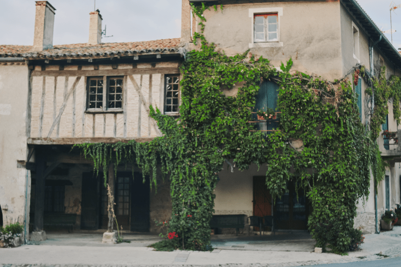

# Spare channels

Use spare channels to effectively isolate and edit complex areas of your compositions and achieve a more precise tonal separation.

All channels

Spare channel Green

Green areas adjusted

## About spare channels

Creating a spare channel from pixel selection or channel information is performed via the **Channels** panel. Spare channels can be useful for making non-permanent adjustments and maintaining a non-destructive workflow. Spare channels target areas accurately as they are based on color and tonal pixel information.

Spare channels reside at the bottom of the Channels panel and can be renamed for better organization within more complex workflows.

**To create a spare channel:**

1. Open the **Channels** panel.
2.  Choose the channel for the desired color information to target.
3. -click the channel and select **Create Spare Channel**.
4. (Optional) Rename the newly created spare channel.

> **Tip:** For the most precise separation and targeting of areas based on channel color information, select a channel that provides the highest contrast.

For example, a Spare Channel Green created can be targeted and treated with a filter or an adjustment. In the image above, the green channel information was addressed to increase vibrance and saturation in the leaves.

## Storing selections

Selections can be saved as spare channels, which allows for selected information to be re-loaded as either a pixel selection or a mask layer. This can help speed up workflows as you can store multiple selections, removing the need to start repeat selections from scratch.

**To target selections based on channels:**

1. On the **Channels** panel, select a channel or create a spare channel from one.
2. -click the channel (or spare channel) entry and select **Load to Pixel Selection**.
3. Add the desired adjustment.
4. When done, on the top menu click **Select**>**Deselect**.

Any adjustment or filter (including Live Filters) will be applied to the area specified by channel information.

#### SEE ALSO:

- [Channels panel](../33-panels/06-channels-panel.md)
- [Selections from channels](../08-selections/01-creating-pixel-selections/07-from-channels.md)
- [Using channels](01-using-channels.md)
- [Masking channels](04-masking-from-channels.md)
- [Applying adjustments](../10-adjustments/01-applying-adjustments.md)
- [Live filters](../06-layers/08-using-live-filters.md)
