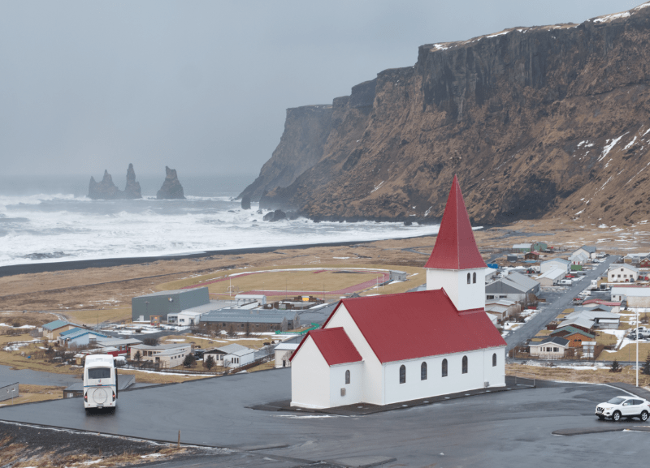
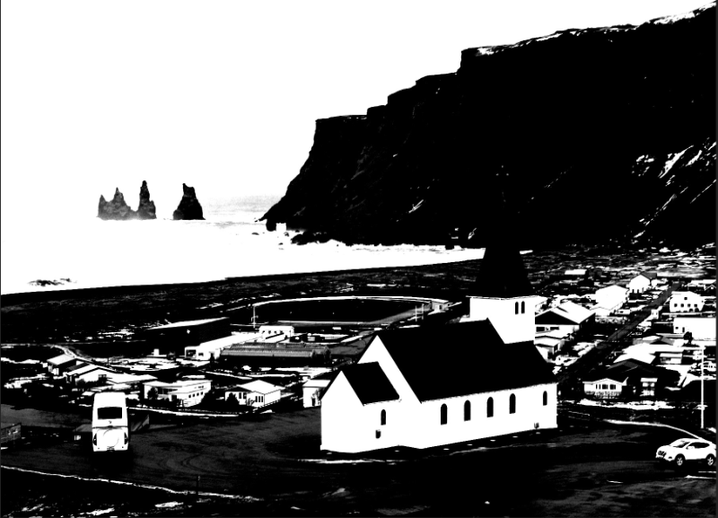

# Masking from channels

Create masks based on channel information to selectively apply and mask adjustments and filters to your compositions.

## Masking and channels

Masking using channel information is a great alternative to working with selections, where parts of compositions can be fine-tuned with more precision. Extracting pixel information from only certain areas, while excluding others from adjustments, is naturally where masking from channels can help. This is particularly true if the areas to extract pixel information from are complex and so other methods of working (such as using Flood Select or Selection Brush tools) take too long or aren't accurate enough.

**To apply a masked adjustment based on channel information:**

1. On the **Channels** panel, select the channel that upon preview (when clicked) provides the most contrasting image.
2. -click the selected channel, then choose **Load to Pixel Selection**.
3. On the top menu, select **Layer**>**New Mask Layer**.
4. On the **Channels** panel, toggle visibility of Red, Green and Blue Channels back on.
5. On the **Layers** panel, select the image mask layer and apply an adjustment or filter, as required.
6. Drag the adjustment or filter layer and offer it to the thumbnail of the image layer.

Adding an Adjustment or Filter (as required) will limit its effect to the area selected based on channel information. Alternatively, your workflow may include an inverted mask to target specific and complex areas.

**To invert a mask:**

1. Select the mask layer.
2. On the top menu, select **Layer**>**Invert**.

> **Note:** If the Channels panel isn't appearing by default, then on the top menu navigate to **Window**>**Channels**.

#### SEE ALSO:

- [Channels panel](../33-panels/06-channels-panel.md)
- [Spare channels](03-spare-channels.md)
- [Saving and loading selections](../08-selections/08-saving-and-loading-selections.md)
- [Pixel selections from channels](../08-selections/01-creating-pixel-selections/07-from-channels.md)
