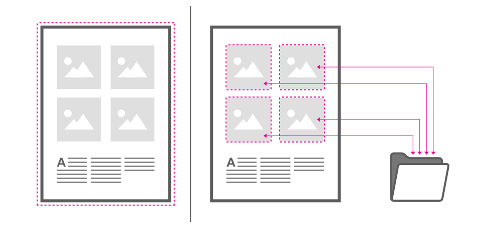

# Embedding vs linking

When placing content you have control over whether files are embedded within the document or linked from their original locations.

## Embedding

A copy of the original file is embedded into the document. As a result, there is no means of checking if the original file is modified at a later date, but the file will be kept with the document when it is moved.

## Linking

Instead of embedding, a link is created between the document and the file on disk to allow it to update (via Resource Manager) if changed on disk. The linked file is never stored in the document.

If one or more linked files have been moved or renamed since you last opened your document, you'll be prompted to locate the file the next time the document is opened.

> **Tip:** It's good practice to keep your linked files in a subfolder within your documents folder. Not only does it keep your images in one place for easier management, but if you move your project to a new location, the links to your files will always be maintained.

### File sizes and embedding/linking

Embedding resources means the document is portable at the expense of a greater file size—all the resources are stored in the document. Linked resources give a much smaller document file size as only link information is stored.

### Alleviating excessive file sizes dynamically

If the amount of embedded content placed in your document exceeds a specific 'size' threshold, you'll be prompted to convert all placed content from embedded to linked automatically. If you agree to this, the image placement policy in Document Setup will also change from **Prefer Embedded** to **Prefer Linked**, so future imported content will be linked by default.

**To set the default content placement policy:**

1. From the **File** menu, click **New**.
2. From the dialog, choose an **Image placement policy**. The **Prefer Embedded** option stores the file in your document; **Prefer Linked** does not embed but maintains a link to the file, still in its original location.

**To change the content placement policy:**

- From the **File** menu, select one of the **Placement Policy** menu options.

**To automatically update linked content:**

1. **macOS:** From the **Affinity Photo 2** menu, select **Settings** (or **Preferences**).
2. **Windows:** From the **Edit** menu, select **Settings**.
3. On the **General** tab, check **Automatically update linked resources when modified externally**.

**To change an embedded file to a linked file:**

1. From the **Window** menu, select **Resource Manager**.
2. From the manager, select the file to be linked and click **Make Linked**.
3. Use the dialog to navigate to a folder to which you want the embedded file to be saved out to and click **Link**.

> **Note:** If an embedded file is made linked its location will be remembered unless it has since been moved.

> **Preferences — Settings (or Preferences):** Related behaviors can be adjusted from [the app's settings](../37-settings-preferences/01-settings-preferences.md):
>
> - **General>Automatically update linked resources when modified externally**

#### SEE ALSO:

- [Placing images](02-placing-content.md)
- [Resource Manager](03-resource-manager.md)
