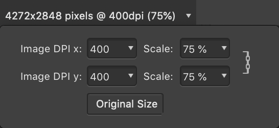

# Placing content

Placing content allows you to include images and Affinity (Designer, Photo, etc.), Photoshop, Illustrator, Freehand or PDF documents in your current document without the need to open each file in turn.

Content placed in this way can be replaced using the options on the context toolbar.

Once you've added embedded documents onto your page, you can edit each document without leaving your current document.

> **Note:** You can also place the contents of existing textual documents, such as Microsoft Word and RTF files. See [Importing text](../26-text/02-importing-text.md) for more information.

## About placing content

Once you've opened your image/document, you can place content.

Some useful tips when placing content include:

- For images, the placed image is added as an image layer rather than a pixel layer. This allows the original image data (e.g., the native resolution, color space and color profile) to be kept. On export to PDF, this data is re-embedded into the PDF file.
- Use the context toolbar's scaling controls to ensure correct sizing of CAD-derived PDFs or PDF/PSD adverts on placement.
- Placed documents offer a **Page Box** option on the context toolbar to choose how the page displays (e.g., with/without bleed, objects only).
- The added content can be rasterized at any time via the **Layer** menu (or via right-click).
- The file's embedded color profile will always be converted to the document's current working space.
- For unprofiled placed images, the color space is assumed to be RGB.
- Some brush operations (e.g., cloning, dodging, etc.) will automatically rasterize image layers to the document resolution; inpainting or selection manipulation on an image layer will require manual rasterization via right-click of the image layer in the Layers panel. You can control automatic rasterization behavior using the [Settings](../37-settings-preferences/01-settings-preferences.md) (or Preferences).

For further information on placing specific file types, please refer to the following table:

| Content type | Comments |
| --- | --- |
| Affinity Designer files with multiple artboards | You'll be provided with an **Artboard** option on the document's context toolbar so you can choose which artboard is displayed. |
| Affinity documents, PDFs and PSD files | The file will be listed in the Layers panel as either an **Embedded document** or **Linked document** depending on the **Image Placement Policy** set during initial Document Setup. |
| PDFs, SVGs, PSD and EPS files | If these are placed as embedded documents, you can edit them within Affinity. If edits are made, these files will be converted to Affinity documents and the original data will not be retained; you will not be able to write the embedded file out to its native file format and make it linked. Other features such as using PDF Passthrough will also then be lost. Please note that the Resource Manager will always display the original file's source filename and location should you need to refer back to it. |
| Affinity documents, PDFs, SVGs, PSD and EPS files | If these are placed as linked documents, you will not be able to edit them directly within Affinity. However, any edits made to the files will be picked up by Affinity and will be reported as **Modified** in the Resource Manager. You can then use the Resource Manager's **Update** button to update the files to match the external changes that were made. |
| Multi-page Affinity documents or PDFs | You can choose which page or spread you want to display by using **Spread** on the context toolbar. For PDF, only one page can ever be displayed, although you can simulate a spread by duplicating the placed object and choosing a different page to view. |
| Placed PDFs | These offer a **PDF Passthrough** option on the context toolbar, which defaults to Passthrough for exact reproduction within your own PDFs. If that's not possible, the Interpret option is selected. A bitmap preview of the PDF’s contents is displayed while editing your document in Affinity Photo 2. |
| Password-protected PDFs | Placing a password-protected PDF will prompt you to enter the file's password. The password is then requested whenever you open the parent document. When the parent document is exported, the resulting PDF does not have to be password-protected. If you wish to protect the exported PDF, ensure you set the required password(s) and restrictions on Affinity's **Export** dialog. |
| Placed PDF, DWG or DXF files containing layers | These offer a **Layers** option on the context toolbar, from which you can choose which of the placed file's layers are visible or hidden in your Affinity document. For example, a layer of a DWG or DXF file might contain notes or more technical information, such as component labeling, that you want to omit for a less technical audience. For PDFs, changing layer visibility will automatically set **PDF Passthrough** to Interpret. |

Once added to your page, you have the option to replace the content, retaining its position, as well as edit placed content.

> **Note:** Affinity Photo 2 converts Smart Objects in Photoshop documents to pixel layers by default. To convert to embedded documents instead, turn on **Import PSD smart objects where possible** in the app's **General** settings. Smart Objects that are linked, meaning their content comes from an external file, are not converted to embedded documents.

## Placing images from the web

Images can be placed by dragging and dropping them from a web browser, either as an embedded or a remote resource.

When an image is placed as a remote resource, its source address (URL) is recorded in your document. Affinity detects when a remote resource has been modified and will either notify you or automatically update the resource, according to the auto-update behavior setting in the app's General settings.

A document's remote resources can be embedded at any time, e.g. when you are ready to send it to a professional printing service or want to create an archive of a publication. The document will retain its record of a resource's source address, which enables it to be made remote again if needed.

> **Warning:** Placing an image as a remote resource may fail for various reasons, e.g. the image is hyperlinked or has a JavaScript attached. If this occurs, try placing the image as an embedded resource instead.

Any image from the Web that is initially placed as an embedded resource does not have its source address recorded and so requires you to perform the same steps again if it needs to be updated.

**To place content:**

Do one of the following:

- From the **File** menu, select **Place**, then in the pop-up dialog navigate to your file and click **Open** when ready. You can then either:
  - Click to place the file at its default, displayed size.
  - Drag on the page to set the size and position of the content.
- **macOS:** From your Finder window, drag and drop the file onto the page to place it. The current image placement policy (embedded or linked) will be honored.
- **Windows:** From your Explorer window, drag and drop the file onto the page to place it. The current image placement policy (embedded or linked) will be honored.
-  From the Tools panel, select the **Place Tool**, then navigate to your file.

> **Note:**  The **Place Tool** is not part of the default tools set. It can however be added via **View**>**Customize Tools** option.

**To scale a placed image/document by DPI, percentage scale or to original size:**

1. Select the image or document.
2. From the context toolbar, select the Image/document Info section and choose an **Image DPI** or **Scale** percentage value from the pop-up menu. Alternatively, click **Original Size** to scale to 100% (native dimensions) and reset aspect ratio.

  

**To return squashed content to its original aspect ratio:**

- With the content selected, double-click on one of its edge handles to reset its aspect ratio.

**To place multiple files:**

1. From the **File** menu, select **Place**.
2. In the pop-up dialog, `Shift`-select the files you wish to place, and click **Open**.
3. The **Place** panel will appear, displaying the files you selected for placement. The files can be placed consecutively from here each time you click on the page or picture frames you would like to place them in until the panel no longer holds any files, starting with the topmost file in the panel. Alternatively, you can click on a file within the panel and then click on the page or picture frame to place that specific file.

**macOS:**

> **Note:** Alternatively, `Alt`-dragging multiple files from Finder to your page will add them directly to the **Place** panel, making it easy to place each file with precision.

**Windows:**

> **Note:** Alternatively, `Alt`-dragging multiple files from Explorer to your page will add them directly to the **Place** panel, making it easy to place each file with precision.

**To place an image from a web browser:**

1. Drag an image from a web page.
2. Do one of the following:
  - To make the image an embedded resource, regardless of your document's image placement policy, drop the image onto your document.
  - To make the image a remote resource, hold the `Ctrl`  and drop the image onto your document.

**To edit an embedded document:**

- Do one of the following:
  - Double-click the placed document.
  - From the context toolbar, select **Edit Document**.

> **Note:** The editability of the embedded document may be affected by how the original document was saved in its native app.

> **Note:** Changes are saved within the main document without affecting the original.

**macOS:**

**To add an image to a layer (via Finder):**

- Drag an image from Finder to your page. The image will be added to the project as a new layer.

**Windows:**

**To add an image to a layer (via Explorer):**

- Drag an image from Explorer to your page. The image will be added to the project as a new layer.

**To replace content:**

1. Select placed content.
2. From the context toolbar, select **Replace image** or **Replace Document** depending on what you've placed.

#### SEE ALSO:

- [Embedding vs linking](01-embedding-vs-linking.md)
- [Resource Manager](03-resource-manager.md)
- [Linked Services](04-linked-services.md)
- [Color management](../12-color/04-color-management.md)
- [Customizing Tools Panel](../31-workspace/04-customize/03-tools-panel.md)
- [Importing text](../26-text/02-importing-text.md)
