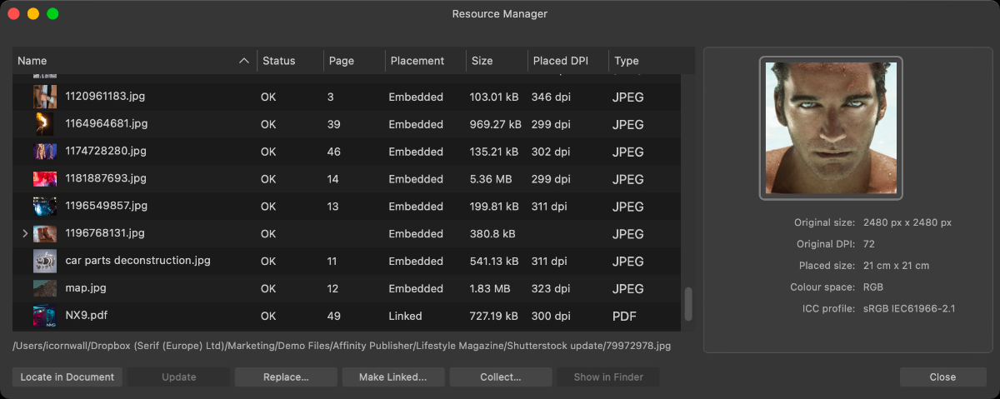

# Resource Manager

The Resource Manager lists all of the image and document resources used in your document.

From the Resource Manager, you can view the status of all resources, the placement of the resource (linked, embedded or remote), the file size, placed DPI, and file type. If the same resource is used multiple times within the document, they will be grouped together in the list.

Right-clicking on any of the column headers allows you check or uncheck columns to display or hide them.

## About placement types

The key difference between linked files and embedded files is the location of the stored data and if data is updated after being linked or embedded.

Embedded files are stored in the document and can't be subsequently updated if the source file changes, i.e. there is no link to the source file.

Linked files are not stored in the document and can therefore be updated (via Resource Manager) in the document from the source file if the source file changes.

Images dragged and dropped from a web browser have a placement value of Embedded by default, regardless of a document's image placement policy, or Remote if the `Ctrl`  is held before dropping onto your document.

A placed image or document can have the following Status:

- **OK**—The file is up to date.
- **Modified**—The linked or remote file has been modified externally. Click **Update**/**Refresh** to get the latest version.
- **Missing**—Although still placed and displayed, the linked file has been deleted or moved externally to the app.

Additionally, you can use the Resource Manager's **Collect** feature to gather a document's resources, which may be distributed between multiple folders, into a single folder for ease of management, e.g. archiving a project when it is complete.

> **Tip:** Use **Save As** if you want to collect resources to a new document which can be shared. You can continue to use the original document with uncollected resources.

> **Note:** Fonts are not included in the collection process.

**To use the Resource Manager:**

1. From the **Window** menu, select **Resource Manager**.
2. Select the resource(s) you need to manage and choose from the available options.

> **Note:** Selecting a resource in the document view automatically highlights its entry on the Resource Manager.

> **Tip:** Double-click on an item in the Resource Manager to locate it on the Layers panel.

The following options are available from the Resource Manager:

- **Locate**—jumps to the resource in your document.
- **Update**/**Refresh**—allows you to update out-of-date linked/remote resources.
- **Relink**—appears in the place of **Update** for missing linked resources, allowing you to relink them. Find and select a missing file using the pop-up dialog to relink it, or, if an entire folder containing multiple linked files has been moved, select the folder to automatically relink all missing files within that folder at once.
- **Replace**—allows you to relocate or replace the selected resource file if missing. Select a replacement file using the pop-up dialog.
- **Make Linked/Embed**—allows you to change a linked or remote resource into an embedded resource or vice versa. When making files linked, specify a save location using the pop-up dialog.
- **Collect**—allows you to collect selected linked document resources in a single specified folder. Specify a folder to collect the linked resources into using the pop-up dialog.
- **Show in **macOS:** Finder**Windows:** Explorer**—reveals the source file for the selected linked resource, if it is not missing.
- **Open Stock URL**—opens the address for the selected remote resource in your system's default web browser.

> **Preferences — Settings (or Preferences):** Related behaviors can be adjusted from [the app's settings](../37-settings-preferences/01-settings-preferences.md):
>
> - **General>Automatically update linked resources when modified externally**

#### SEE ALSO:

- [Placing content](02-placing-content.md)
- [Embedding vs linking](01-embedding-vs-linking.md)
- [Linked Services](04-linked-services.md)
