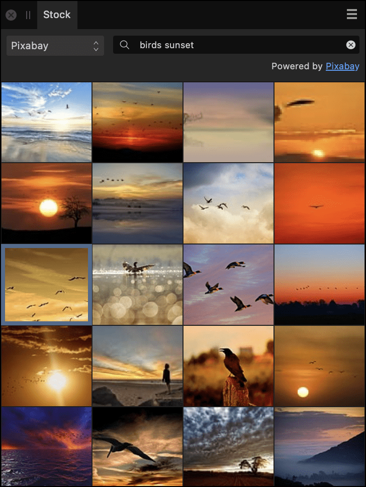

# Using stock photos

The [Stock panel](../33-panels/25-stock-panel.md) allows you to search various stock imagery websites to find images and then add them to the page or create new documents from them.

*The Stock panel populated with images.*

**To search for stock images:**

On the **Stock** panel:

1. Select a stock imagery website from the pop-up menu.
2. In the search box, type in your keyword(s) and then click the search icon or press the **Return** key.

Thumbnails of all images matching the search criteria will display in the panel.

> **Note:**  You can clear search results using the close icon.

**To add an image to your page:**

- Drag an image thumbnail from the panel onto the page. It will be placed using its original dimensions.

**To create a new document from an image:**

Do one of the following:

- With no documents open, drag an image thumbnail from the panel onto the empty workspace.
- With a document(s) already open, drag an image thumbnail from the panel and drop it on the Toolbar.

The new document will have the same dimensions as the image.

**To view an image on its stock imagery website:**

- On the image's context toolbar, select **Open Stock URL**. Your default web browser will launch displaying your selected image on the chosen stock imagery website.

> **Note:** The image owner's profile can be viewed by clicking **Open Stock URL** option and navigating to the author's profile page.

#### SEE ALSO:

- [Stock panel](../33-panels/25-stock-panel.md)
