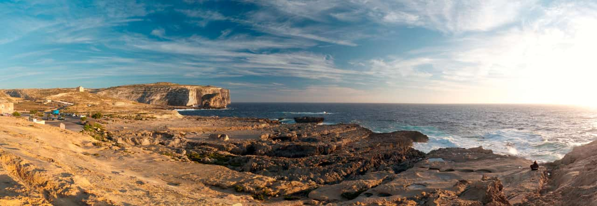

# Stitching panoramas

> **Note:** Panoramas are created by stitching together multiple images in a dedicated workspace for panorama editing.

Multiple images can be stitched together to create a wider and taller scene, referred to as a panorama. The benefits of creating a panorama are:

- Capturing a much wider view of a scene.
- Producing higher resolution images than can be achieved with just one exposure; useful for printing large images and other large size applications.

You can create multiple panoramas simultaneously from your image collection. Each detected panorama is stitched and previewed, before you create your panorama(s) by preview selection. A new document is created per panorama.

Individual Images

Final Panorama

## Shooting tips

- Where possible, use either a tripod or fast shutter speeds to avoid motion blur; blurry subjects will produce poor results when stitching.
- Keep your exposure settings (shutter speed, aperture, ISO, white balance) identical between shots to produce a consistent result.
- Try to avoid shooting at extreme wide angles as this will introduce lens distortion. If you are using a typical zoom kit lens (e.g., 18-55mm), try zooming in to its maximum focal length.
- Always shoot from the same vantage point for best results.

**To stitch one or more panoramas:**

1. From the **File** menu, select **New Panorama**.
2. From the dialog, click **Add** to locate and select your images.
3. (Optional) If you have images you do not wish to include, you can uncheck them from the image list.
4. Click **Stitch Panorama** to stitch images together. One or more previews are generated in the adjacent **Panoramas** window.
5. (Optional) For multiple panoramas, deselect a preview thumbnail if you don't want to make that panorama.
6. Click **OK** (this may take time depending on number of images and their complexity).

You may need to fine-tune your panorama using masking and transforming techniques (see [Editing panoramas](02-editing-panoramas.md)) before removing unwanted transparent regions using cropping or inpainting.

**To finish your panorama:**

In the Panorama dialog, do one of the following:

-  Select the **Crop Tool**, and from its context toolbar, select **Crop to Opaque**.
-  Select **Inpaint Missing Areas** from above your panorama. The inpainting process takes place on exit and intelligently replaces transparent regions at the edge of your image with alternative image content.

#### SEE ALSO:

- [Editing panoramas](02-editing-panoramas.md)
- [Image stacks](../17-stacking/01-image-stacks.md)
