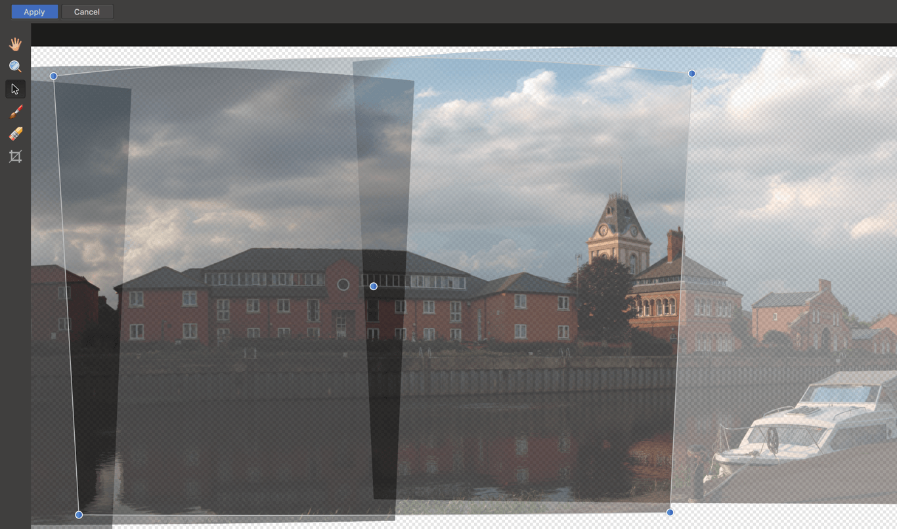
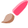

# Editing panoramas

If panorama stitching yields alignment errors or you simply require more control over how each image is stitched, you can further edit the panorama between the initial stitching and the final result.

**To edit a panorama:**

1. Create a new panorama following the instructions listed in [Stitching panoramas](01-stitching-panoramas.md).
2. When the initial stitching is complete, the panorama will be opened with a selection of tools available.    
  
 
3. To correct alignment, use the **Transform Source Image Tool** and click-drag the corner handles of stack images to transform them. The center handle can also be dragged to alter the stack image's position.
4. For more detailed editing, use the **Add to Source Image Mask Tool** to paint in areas that you want to use from the stack's surrounding images. Use the **Erase from Source Image Mask** to remove areas.
5. Make your edits accordingly, then click **Apply** and the final panorama will be rendered.

**Panorama editing tools:**

-  **Hand Tool**— move across the panorama by click-dragging.
-  **Zoom Tool**— zoom in and out of the panorama.
-  **Transform Source Image**—manipulate the corners of each stitched image to manually align them.
-  **Add to Source Image Mask**—add an area to the current image mask that will reference the surrounding stacks.
-  **Erase from Source Image Mask**—erase an area from the current image mask; this will use the original image's data rather than referencing from the surrounding stacks.
-  **Crop**—crop the panorama to remove transparent/missing areas.
-  **Inpaint Missing Areas**—automatically inpaints missing areas (represented by transparent checker-boarding) when the final panorama is rendered. Enabled by default.

> **Note:** When using **Add to Source Image Mask** and **Erase from Source Image Mask**, single-click on the correct stack image first to select it. Unused areas of a stack image are covered in a transparent overlay.

#### SEE ALSO:

- [Stitching panoramas](01-stitching-panoramas.md)
- [Keyboard shortcuts for tools](../36-keyboard-shortcuts/01-keyboard-shortcuts.md)
