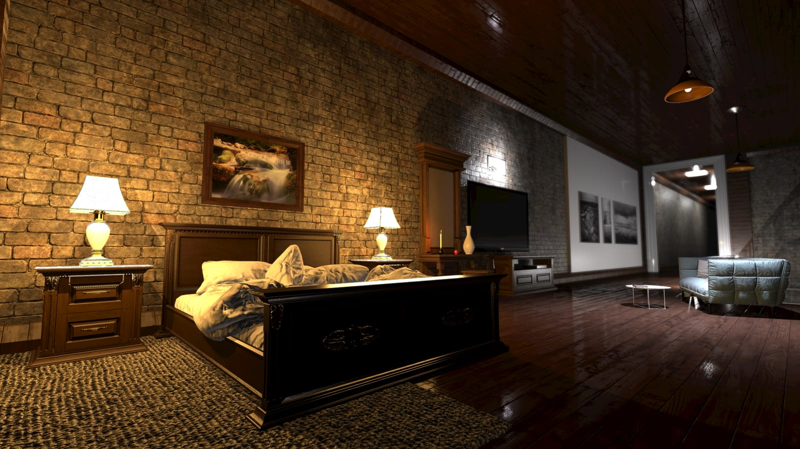
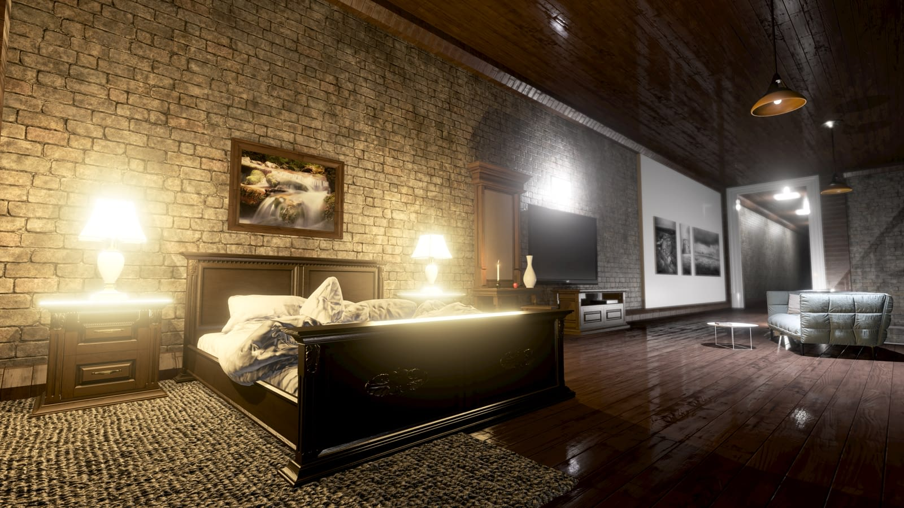
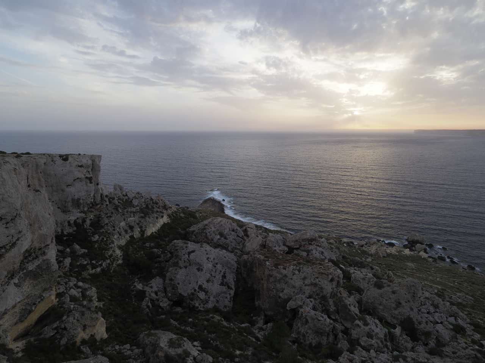
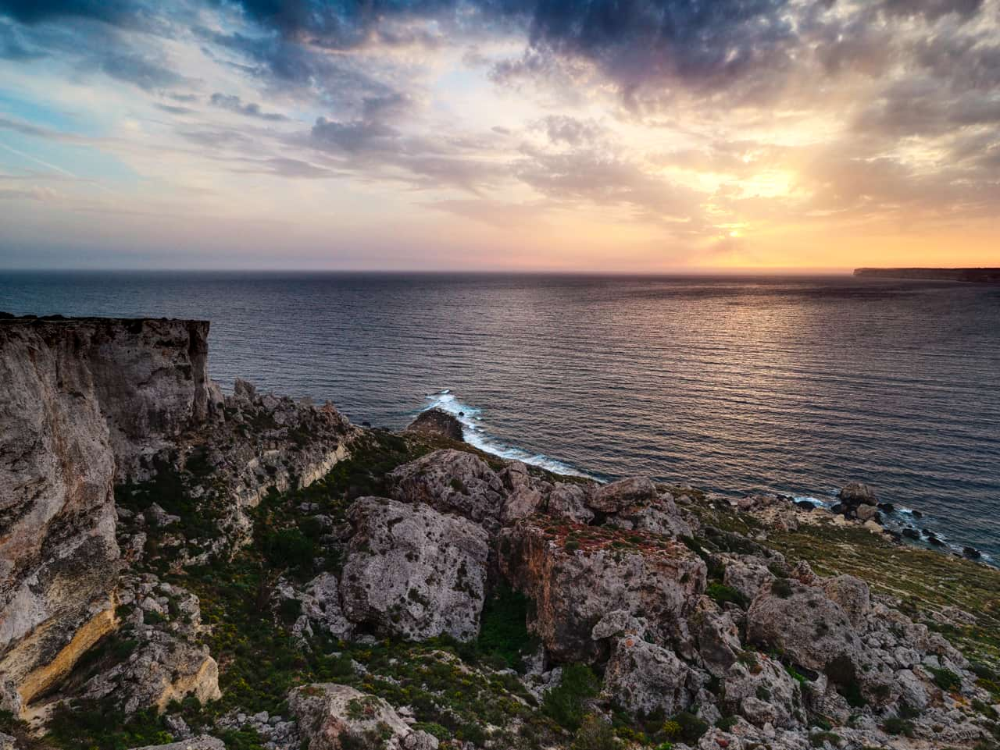

# 32-bit HDR editing

Affinity Photo 2 has full support for 32-bit float editing, including import/export for [OpenEXR](04-32-bit-openexr-support.md) and Radiance formats. Compared to 8-bit or 16-bit, 32-bit presents an unbounded color space that can contain a vast amount of tonal information. This means the information can be modified to extremes without losing fidelity or accuracy. For example, highlight detail blown out by an adjustment or filter can be recovered even after successive operations.

Support is included for HDR (High Dynamic Range) or EDR (Extended Dynamic Range) compliant displays, enabling a much higher peak brightness to be displayed on-screen. See the [32-bit Preview panel](../33-panels/01-32-bit-preview-panel.md) topic for more information.

## Uses for 32-bit HDR

Popular uses for 32-bit editing include:

- HDR merging from several exposures to produce an image with greatly increased dynamic range. The result typically has to be tone mapped in order to be viewed properly on most displays.
- 3D render editing. Full renders and buffer passes from 3D software and 3D engines can be professionally color managed and edited losslessly.
- General image editing and design work with increased precision. Useful for fine gradient work, heavy tonal manipulations and composite work.
- Viewing and editing high dynamic range imagery in conjunction with an HDR or EDR compliant display.

> **Tip:** If you are using 32-bit editing for lossless workflows (e.g., 3D compositing/rendering) where you are not compressing or modifying the tonal range, you can use the [32-bit Preview panel](../33-panels/01-32-bit-preview-panel.md) to preview different areas of the large 32-bit tonal range. The added functionality of [OpenColorIO](05-using-opencolorio.md) can be accessed through this panel.

> **Tip:** For 32-bit HDR documents and EDR/HDR displays, the **Color** panel offers an **Intensity** slider to create unbounded color values. You can preview it with an SDR display by using the **Preview Exposure** slider on the **32-bit preview** panel.

> **Note:** Photo supports multi-layered (multichannel) OpenEXR documents. For more information, see [32-bit OpenEXR support](04-32-bit-openexr-support.md).

> **Preferences — Settings (or Preferences):** Related behaviors can be adjusted from [the app's settings](../37-settings-preferences/01-settings-preferences.md):
>
> - **macOS:** **Color>Enable EDR by default in 32-bit RGB Views**
> - **Windows:** **Color>Enable HDR by default in 32-bit RGB Views**

## Examples

### 3D render passes

***Before**: Base HDR color render pass of a 3D scene. **After**: Base HDR color tone mapped and blended with scene color pass.*

### Exposure merging for greater dynamic range

***Before**: Single exposure from camera. **After**: 7 bracketed exposures merged and lightly tone mapped.*

#### SEE ALSO:

- [Merging to 32-bit HDR](02-merging-to-32-bit-hdr.md)
- [Tone Mapping HDR images](03-tone-mapping-hdr-images.md)
- [32-bit Preview panel](../33-panels/01-32-bit-preview-panel.md)
- [Color panel](../33-panels/08-color-panel.md)
