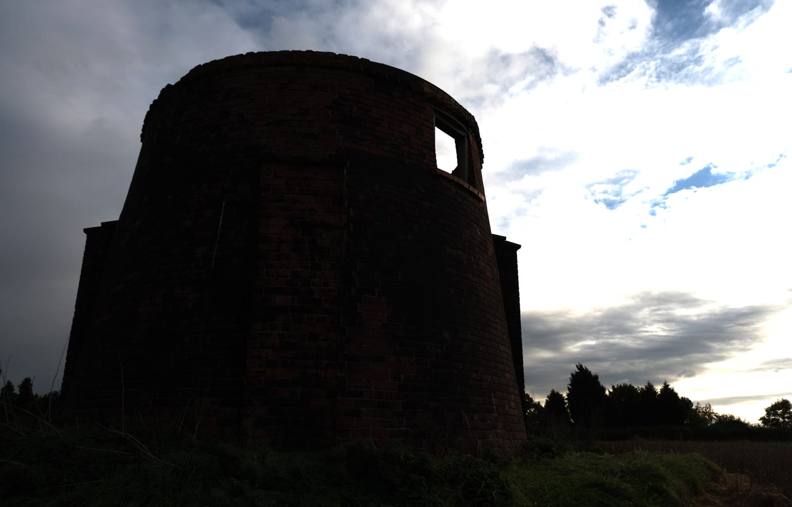
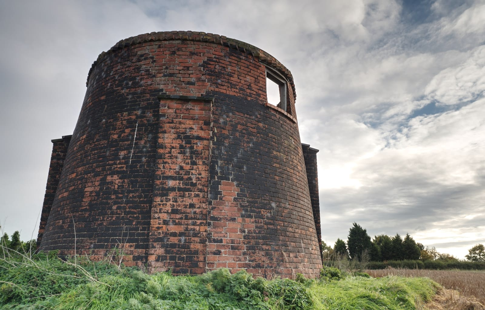

# Merging to 32-bit HDR

Multiple exposures of the same subject can be merged to produce an unbounded 32-bit document, which contains a significant amount of tonal range—more, in fact, than most displays outside of specialized equipment can reproduce. The resulting 32-bit image can then be edited with Photo's extensive set of tools, adjustments and filters, or it can be tone mapped in order to map the extensive 32-bit tonal range to a result that looks suitable for most displays.

**To HDR merge several images:**

1. From the **File** menu, select **New HDR Merge**.
2. From the dialog, click **Add** to locate and select your images.
3. (Optional) Choose a Perspective or Scaling operation from the menu to allow for successful auto-alignment. The former applies a perspective adjustment to each image; the latter repositions and/or sizes the image layer.
4. (Optional) If your image set contains moving subjects between each exposure, check **Automatically Remove Ghosts**.
5. (Optional) Keep **Noise reduction** checked to enable color and luminance noise reduction; Uncheck to disable noise reduction (you can address this post HDR merge using the Denoise filter).
6. Click **OK** to begin merging the images.

The HDR merging is previewed in stages: first, the image alignment, then the HDR merge itself. By default, the merged result will then be taken into the **Tone Mapping Persona** for tone mapping. See [Tone Mapping HDR images](03-tone-mapping-hdr-images.md) for more information.

> **Tip:** You can stop Photo from automatically entering the Tone Mapping Persona and tone mapping your 32-bit image. On the **New HDR Merge** dialog, uncheck **Tone map HDR image**. Once the HDR merge is complete, you will then remain in the Photo Persona to make further edits.

> **Tip:** If you choose not to automatically tone map your image, the **Sources** panel will be displayed, allowing you to manually retouch the merged result. If **Automatically Remove Ghosts** was checked, the **Sources** panel will contain a de-ghosted source as well as the original merged source. For more information, see [Sources panel](../33-panels/24-sources-panel.md).

Below you will see a 32-bit image being displayed as 8-bit with no tone mapping or further tonal adjustments applied. 32-bit simply contains too much tonal range to display, so we typically apply a procedure called *Tone Mapping* to map that tonal information to a range that can be displayed accurately. See the topic [Tone Mapping HDR images](03-tone-mapping-hdr-images.md) for more information.

***Before**: A 32-bit image with **no** tone mapping—the range of 32-bit is too great to display. Instead we see an image with extreme contrast.  
 **After**: A 32-bit image after being tone mapped. The vast range of tonal information has been "mapped" to a range that can be reproduced by most displays.*

Once work on a 32-bit image is completed, you may need to convert its color format and, crucially, its color profile if you intend to distribute or share it. For example, you might want to export as an 8-bit JPEG with an sRGB color profile. Alternatively, if you are maintaining a lossless workflow, you can stay in 32-bit and export to a linear unbounded format.

**To convert the color format and profile before export:**

1. From the **Document** menu, select **Color Format** and choose your desired format; for example, RGB 8-bit.
2. A color profile will be automatically assigned: for RGB 8-bit/16-bit documents, this will be **sRGB IEC61966-2.1**.

**To maintain a 32-bit workflow for importing into other software:**

1. From the **File** menu, select **Export**.
2. Choose the **OpenEXR** format and click **Export**, then specify where to save your document.

#### SEE ALSO:

- [Tone Mapping HDR images](03-tone-mapping-hdr-images.md)
- [32-bit HDR editing](01-32-bit-hdr-editing.md)
