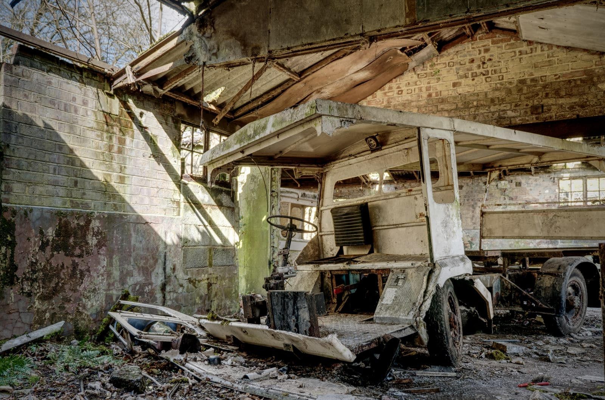
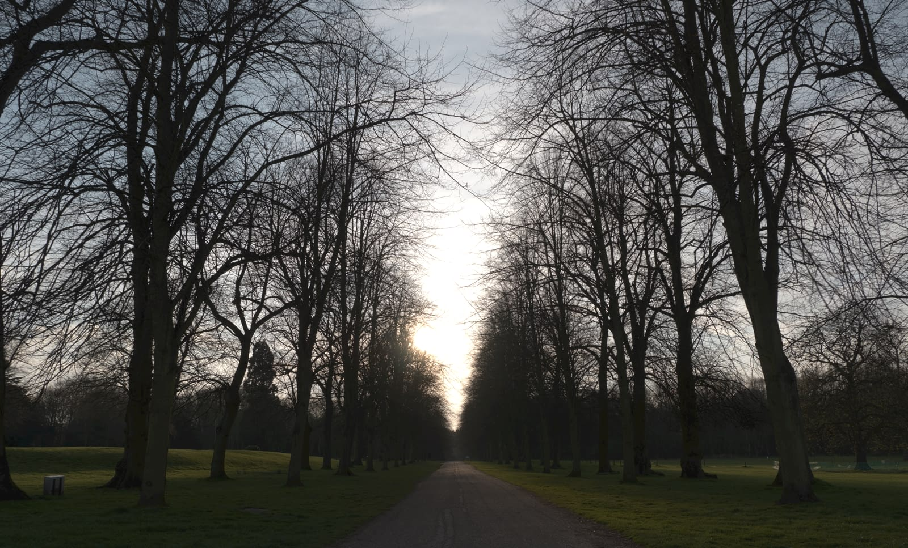
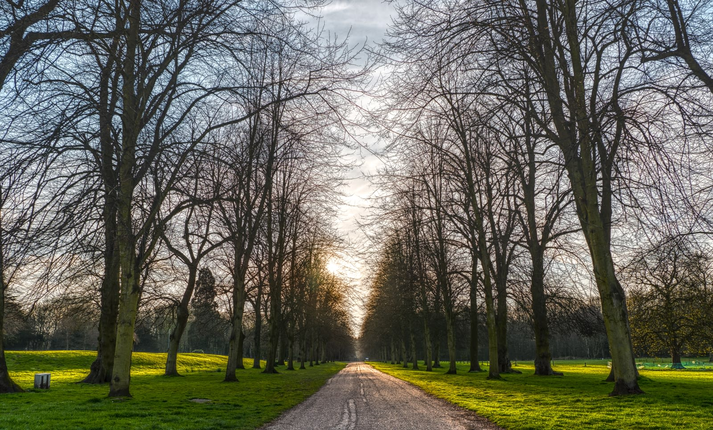

# Tone Mapping HDR images

Tone Mapping is the process of taking a range of tones and remapping them to a smaller range that most displays and other devices can accurately reproduce.

*A tone mapped 32-bit image.*

## About HDR

Affinity's **Tone Mapping Persona** can be used to produce high quality images of extended dynamic range, even from seemingly flat captures. Upon entering the persona, the RAW or image layer is rasterized, however this behavior can be changed in the app's Settings.

> **Note:** Prior to entering the Tone Mapping Persona, ensure you have selected the correct image or RAW layer in the panel.

**To tone map an HDR image:**

1. With a 32-bit document open, select a pixel layer and then click **Tone Mapping Persona**.
2. Once in the Tone Mapping Persona, your image will have a default tone map applied to it.
3. Experiment with the adjustments in the **Tone Map** panel. See below for a list of options.
4. On the context toolbar, click **Apply**.

*Before/after of a tone mapped image.*

> **Note — Presets:** The Tone Mapping Persona contains a number of presets that appear on the left hand side within the **Presets** panel. Simply click one to apply it. You can also create your own presets, or import new ones.

### Settings (or Preferences)

The following settings are available in the **Tone Map** panel:

- **Clamp to SDR**—clamps values greater than 1, ensuring the tone mapped result does not have any remaining out-of-bound values.
- **Tone Compression**—controls how much of the unbounded tonal range to map. Increasing the slider results in more tone compression.
- **Local Contrast**—adds or removes local contrast. Increasing local contrast helps to boost clarity in the image.
- **Exposure**—raises or lowers the overall exposure.
- **Black Point**—sets the black clipping level. Increase to further clip black tones.
- **Brightness**—controls mid tone levels. Increase to raise mid tones.
- **Contrast**—controls global contrast. Use in conjunction with Clarity to significantly change the tone mapped look.
- **Saturation**—adds or decreases overall color intensity.
- **Vibrance**—adds or decreases color intensity without clipping color tones.
- **White Balance**—changes the balance of color tones. Tones can be made cooler or warmer by dragging the **Temperature** slider, and color casts can be corrected using the **Tint** slider.
- **Shadows & Highlights**—controls compression of shadow and highlight tones. Useful for fine tuning tones.
- **Detail Refinement**—controls additional sharpening to the image. Its effects are more subtle compared to the **Detail Refinement** found in the Develop Persona. For a "gritty", over sharpened effect, try a large **Radius** value and small **Amount** value.
- **Curves**—allows adjustment of tonal range using a curves graph.

> **Tip:** To reset slider values back to default, double-click on the slider button.

> **Tip — Tone Mapping non-HDR images:** The Tone Mapping Persona can also be entered from non 32-bit documents, which means you can achieve a tone mapped look from any 8 or 16-bit imagery.

#### SEE ALSO:

- [Merging to 32-bit HDR](02-merging-to-32-bit-hdr.md)
- [32-bit HDR editing](01-32-bit-hdr-editing.md)
