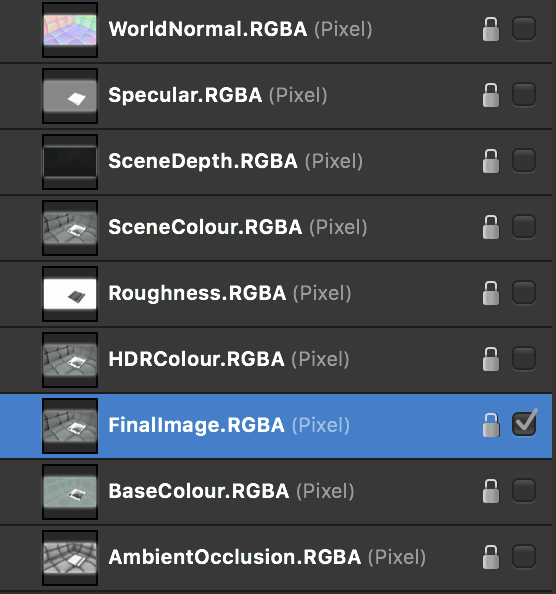

# 32-bit OpenEXR support

Affinity Photo 2 has full OpenEXR 32-bit document support, including multichannel (or "multilayer") import and export.

## OpenColorIO Integration

With an OpenColorIO configuration (see [OpenColorIO](05-using-opencolorio.md) for more information), OpenEXR documents with a valid color space affix (eg **filename_acescg.exr**) will be converted from that color space to **scene_linear** upon import.

## Additional configuration

Additional OpenEXR options are available from the **Color** options on the [Settings (or Preferences)](../37-settings-preferences/01-settings-preferences.md) menu:

- **Associate OpenEXR alpha channels**—when enabled, alpha channel information is merged to its associated RGB pixel layer's alpha channel. By default (disabled), imported alpha channels are imported as separate layers with an **.A** affix.
- **Post divide EXR colors by alpha**—when enabled, divides color channels by the alpha channel.
- **Perturb zero EXR alpha**—when enabled, alters zero alpha information so post-division with color channel information can be achieved if **Post divide EXR colors by alpha** is enabled. By default (disabled), zero alpha information is left untouched.

## Multichannel import/export

Photo supports multichannel OpenEXR documents for both import and export.

### Multichannel import:

- Each channel is imported to a discrete layer in the Layers panel.
- Each layer retains its affix (e.g., **.RGBA**, **.XYZ**).
- Layers can be hidden or shown and edited individually.

### Multichannel export:

- Each discrete layer with its channel affix (e.g., **.RGBA**) is exported to its own channel.
- All layers are exported to channels regardless of whether they are hidden or shown at the time of export.
- In order to export as multichannel OpenEXR, either the correct preset must be chosen, or the multichannel setting must be enabled on the OpenEXR export dialog. See below for more information.

*An example of how a multichannel OpenEXR document looks once imported.*

**To export a multichannel OpenEXR document:**

1. From the **File** menu, choose **Export**.
2. Select the **EXR** export format.
3. From the **Preset** pop-up menu, select **OpenEXR 32-bit linear (layered)**.
4. (Optional) Access the **More** dialog to configure the multilayer settings:
  - **Include unknown channels**—channels whose type cannot be determined will still be exported as a single luminance-based channel.
  - **Compression**—determine a compression format to use for a reduced file size. Compression may also be disabled entirely.
  - **Image pixels**—choose whether to encode Image channels (**RGBA** etc) as 16-bit (half float) or 32-bit (full float).
  - **Spatial pixels**—choose whether to encode Spatial channels (**XYZ** etc) as 16-bit (half float) or 32-bit (full float).
  - **Other pixels**—choose whether to encode other/undetermined channels as 16-bit (half float) or 32-bit (full float).
5. Choose **Export** to export the document to a chosen filename and directory.

#### SEE ALSO:

- [32-bit HDR editing](01-32-bit-hdr-editing.md)
