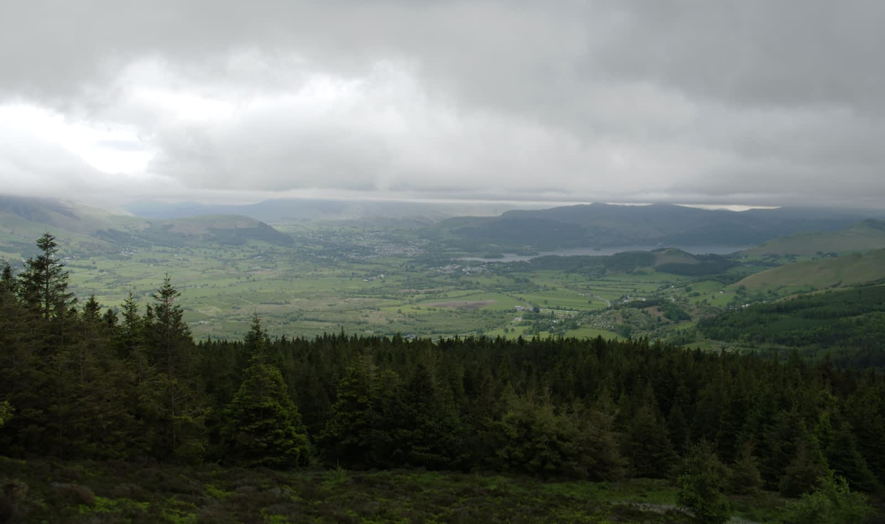

# Exposure merging using stacks

Exposure merging brings together images deliberately shot at different exposure levels to produce an image of a higher dynamic range. Such an approach is likely when areas in your shot are in high contrast and you'd like to bring together differently exposed areas as a solution.

Not to be confused with HDR merge, exposure merging composites images without creating an HDR image or applying HDR tone mapping, producing quicker and often more natural results.

Exposure 01

Exposure 02

Final Exposure

## Shooting tips

Here are a few things to consider when shooting.

- To allow for perfect image alignment, use a tripod or ensure your camera is in a fixed position.
- Ensure enough photos have been taken to cover the full dynamic range required from the scene.
- If available, you can take advantage of your camera's auto bracketing feature to obtain photos at multiple exposure levels.
- Take advantage of continuous shooting modes to automatically capture your images.
- Avoid flash photography.

**To create an exposure merging stack:**

1. From the **File** menu, select **New Stack**.
2. From the dialog, click **Add** to locate and select your images. Click **Open** to add the images to the stack list.
3. Click **OK**.
4. On the **Layers** panel, select the **Mean** or **Mid-Range** stack mode from the Stack Mode pop-up menu on the Live Stack Group layer.

#### SEE ALSO:

- [Image stacks](01-image-stacks.md)
- [Object removal using stacks](03-object-removal-using-stacks.md)
- [Noise reduction using stacks](04-noise-reduction-using-stacks.md)
- [Creative effects using stacks](05-creative-effects-using-stacks.md)
- [Layer masks](../06-layers/12-layer-masks.md)
