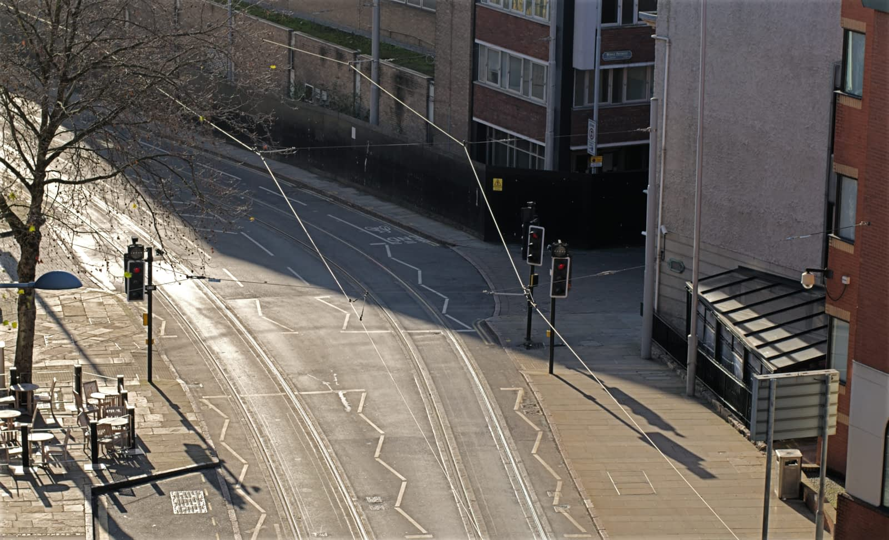

# Object removal using stacks

Object removal solves the problem of moving subject matter being included in your images—think of passing crowds, vehicles, birds flying, or other annoying distractions. Obviously, a single shot taken at a specific time may be the perfect solution but it may not be practical or possible to wait for this.

Exposure 01

Exposure 02

Exposure 03

Exposure 04

Final Exposure

## Shooting tips

- To allow for perfect image alignment, use a tripod or ensure your camera is in a fixed position.
- Take a pragmatic approach and be realistic. Scenes full of moving objects cannot be completely emptied, nor will stationary objects magically disappear (but can be made to using the Inpainting Brush Tool later!).

**To create an object removal stack:**

1. From the **File** menu, select **New Stack**.
2. From the dialog, click **Add** to locate and select your images. Click **Open** to add the images to the stack list.
3. Click **OK**.
4. On the **Layers** panel, select the **Median** stack mode from the Stack mode pop-up menu on the Live Stack Group layer.

> **Note:** Be prepared to selectively retouch images in your stack if ghosting occurs. This may be due to the same or different objects overlapping in more than one image. To resolve, add a mask to your problem image in the stack (hide/show each image layer to locate the ghosting effect).

#### SEE ALSO:

- [Image stacks](01-image-stacks.md)
- [Exposure merging using stacks](02-exposure-merging-using-stacks.md)
- [Noise reduction using stacks](04-noise-reduction-using-stacks.md)
- [Creative effects using stacks](05-creative-effects-using-stacks.md)
- [Layer masks](../06-layers/12-layer-masks.md)
