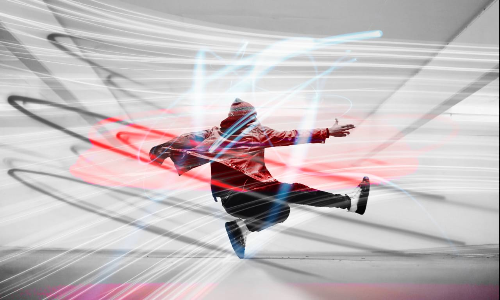

# Creative effects using stacks

Stacking can be used for more individual, creative effects that require specific image content to achieve.

Creative Frame 01

Creative Frame 02

Creative Frame 03

Maximum Stack Mode

## Shooting tips

Here are a few things to consider when shooting.

- To help image alignment (if you are using it), use a tripod or ensure your camera is in a fixed position.
- Try and use a fixed white balance to avoid large differences in tone between the shots.

**To create a stack:**

1. From the **File** menu, select **New Stack**.
2. From the dialog, click **Add** to locate and select your images. Click **Open** to add the images to the stack list.
3. Click **OK**.
4. On the **Layers** panel, experiment with the **Stack Mode**. **Median** is selected by default, but try **Maximum** and **Range** in particular for more creative effects.

#### SEE ALSO:

- [Image stacks](01-image-stacks.md)
- [Object removal using stacks](03-object-removal-using-stacks.md)
- [Exposure merging using stacks](02-exposure-merging-using-stacks.md)
- [Noise Reduction using stacks](04-noise-reduction-using-stacks.md)
- [Layer masks](../06-layers/12-layer-masks.md)
