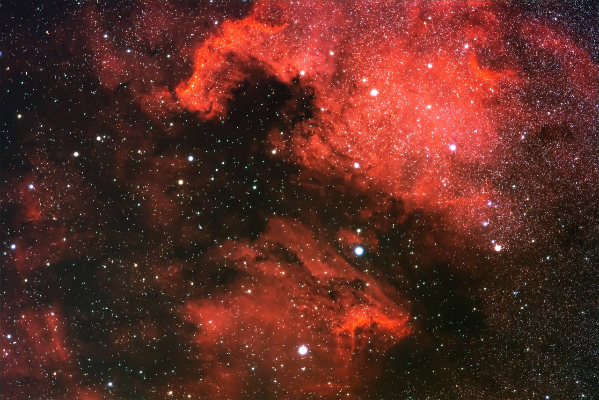

# About astrophotography stacking

Affinity Photo 2's **Astrophotography Stack Persona** is used to create high-quality celestial images.

It requires light frames, which are long exposures of the night sky, and several kinds of calibration frame. Stacking of the light frames increases the SNR (signal-to-noise ratio).

The stacking process is performed to 32-bit linear unbounded floating point precision throughout, which maximizes your options for tone-stretching and other post-processing you might perform.

## About calibration frames

Calibration frames help to clean up imagery, by identifying and removing noise from the light frames—the excess of it, at least—as well as dust spots, vignetting and other artefacts.

The use of calibration frames is optional but strongly recommended.

Noise is inherent in the shooting environment and is influenced by several factors, including: overall thermal conditions, which can vary over time; background electrical interference in the camera; and hot pixels in the camera sensor. For example, hot pixels could be misidentified as stars, affecting alignment during stacking.

### Types of calibration frame

Affinity Photo 2 can process four kinds of calibration frame, each of which identifies different noise.

- **Dark frames**—identify hot pixels and thermal noise, arising from long exposure times, to be cleaned from the light frames. Taken during the same session and at the same shutter speed as light frames but with the lens cap on.
- **Bias frames**—identify electrical read noise from the camera. Taken at the fastest shutter speed available with the lens cap on.
- **Flat frames**—identify artefacts such as dust specks and lens vignetting, ensuring evenly illuminated images. Captured during the same session as light frames.
- **Dark flat frames**—to pre-process the flat frames by cleaning noise from them, like dark frames do for light frames. Taken at the same shutter speed as the flat frames.

Light

Bias

Dark

Flat

Dark flat

End result

In practice, multiple frames of each type are used to improve the SNR ratio and improve the end result.

## File formats

Light frames and calibration frames should be RAW or FITS (Flexible Image Transport System) files from a DSLR or astronomy camera, respectively.

They must be unprocessed for best results to avoid assumptions being made about white balance and tonality, which are approximated later in the compositing process.

> **Note:** [FITS (Flexible Image Transport System)](https://fits.gsfc.nasa.gov) is a file format commonly used in astrophotography that can contain extra metadata not found in RAW files. It is usually captured by CCD and CMOS astronomy cameras used with telescopes. Affinity Photo 2 recognizes FITS files with a .fit or .fts file extension.

> **Tip:** In the Photo Persona, opening an individual FITS file that contains Bayer pattern metadata displays the **Develop FITS** dialog.
>
> You might do this with individual FITS files from a photo shoot to inspect their quality, or with master FITS files containing calibrated and stacked data to manually combine, align and process them.
>
> The dialog's **FITS Bayer Pattern** setting infers the Bayer pattern of the camera's color sensors by default, but can be manually set to a specific pattern if the results look incorrect.

#### SEE ALSO:

- [Creating an astrophotography stack](02-creating-an-astrophotography-stack.md)
- [Files panel](03-files-panel.md)
- [Stacking Options panel](05-stacking-options-panel.md)
- [RAW Options panel](04-raw-options-panel.md)
- [Compositing narrowband images](06-compositing-narrowband-images.md)
