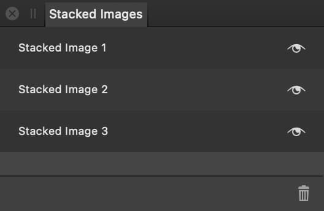
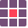

# Creating an astrophotography stack

The Astrophotography Stack Persona's key controls are located in the right studio, where you can specify the files to be stacked and how they are processed.

On the Tools panel, the Persona provides the **[Bad Pixel Map Tool](../32-tools/14-astrophotography-tools/01-bad-pixel-map-tool.md)**, which helps to identify and correct defective pixels that originate in a camera setup.

## Studio panels

- **[Files](03-files-panel.md)**—specify the light frames and calibration frames to be processed.
- **[Stacking Options](05-stacking-options-panel.md)**—choose and control the stacking method used to process the frames.
- **[RAW Options](04-raw-options-panel.md)**—choose how the frames are interpreted.
- **Stacked Images**—all images created during a single session in the Persona are added here.

## Requirements

At minimum, a set of light frames must be added to the **Files** panel. It is recommended that you add [calibration frames](01-about-astrophotography-stacking.md) as well.

Each set of light frames and calibration frames constitutes a file group. Multiple file groups can be added to the panel for processing into a single end result.

Each file group should contain frames taken at different times, i.e. across several nights, during which shooting conditions may have changed.

## About the Stacked Images panel

Use the **Stacked Images** panel to compare results from using different files and options.

To rename a stacked image, double-click it on the panel.

Each stacked image becomes a pixel layer (of the same name) in the resulting Affinity Photo 2 document.

**Astrophotography stack editing tools:**

-  **Hand Tool**— move around the document by dragging on it.
-  **Zoom Tool**— zoom in and out of the document.
-  **Crop Tool**—crop the document to remove unwanted areas.
-  **Bad Pixel Map Tool**—automatically or manually identify defective pixels in specific kinds of calibration frame.

**To open the Astrophotography Stack Persona:**

- Select **File>New Astrophotography Stack**.

**To add files:**

1. On the **Files** panel, set **Type** to Light frames, then select **Add Files**.
2. Browse to your light frames, select them, then select **Open**.
3. (Optional but recommended) For each set of calibration frames that you have shot:
  1. Set **Type** as appropriate.
  2. Select **Add Files**.
  3. Browse to the corresponding frames, select them, then select **Open**.
4. (Optional) For each collection of light and calibration frames taken at a different time, select **Add a file group** and repeat steps 1 through to 3 as appropriate.

**To start stacking:**

1. (Optional) Adjust the Persona's [stacking options](05-stacking-options-panel.md).
2. (Optional) Adjust the Persona's [RAW options](04-raw-options-panel.md).
3. On the context toolbar, select **Stack**.

When the stacking process is complete, its end result is added to the **Stacked Images** panel.

The frames you added remain in the **Files** panel, enabling you to add additional frames or file groups and adjust settings to create additional stacked images, i.e. to try for improved results.

**To finish stacking and save your document:**

1. On the context toolbar, select **Apply**. The workspace switches to the Photo Persona.
2. Select **File>Save**.
3. Browse to where you want to save your document.
4. Name your document and select **Save**.

Upon leaving the Astrophotography Stack Persona, each image in the **Stacked Images** panel is added as a new pixel layer near the bottom of the document's layer stack.

Curves and Levels adjustments, with settings calculated during the stacking process, are added at the top of the layer stack. Perform any post-processing you wish, including editing these adjustments.

#### SEE ALSO:

- [About astrophotography stacking](01-about-astrophotography-stacking.md)
- [Files panel](03-files-panel.md)
- [Stacking Options panel](05-stacking-options-panel.md)
- [RAW Options panel](04-raw-options-panel.md)
- [Bad Pixel Map Tool](../32-tools/14-astrophotography-tools/01-bad-pixel-map-tool.md)
- [Compositing narrowband images](06-compositing-narrowband-images.md)
